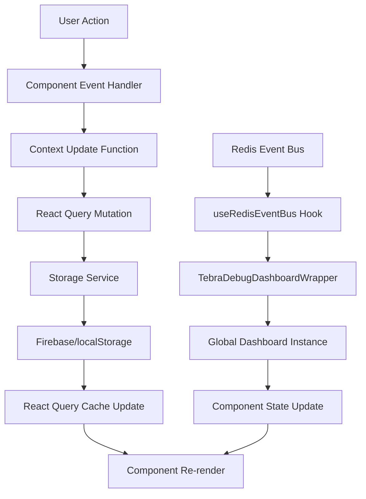

# React Dashboard Component Architecture

**Version**: 1.0  
**Last Updated**: 2025-07-03  
**Authors**: Claude Code Assistant  

## Table of Contents

1. [Overview](#overview)
2. [Component Architecture](#component-architecture)
3. [State Management](#state-management)
4. [Integration Points](#integration-points)
5. [UI/UX Architecture](#uiux-architecture)
6. [Testing Strategy](#testing-strategy)
7. [Performance Patterns](#performance-patterns)
8. [Error Handling](#error-handling)
9. [Development Guidelines](#development-guidelines)
10. [Troubleshooting](#troubleshooting)

## Overview

The React Dashboard is a sophisticated healthcare workflow management system built with React 18, TypeScript, and Tailwind CSS. It manages patient flow, real-time status updates, and integrates with external systems including Tebra EHR and Firebase backend services.

### Key Features

- **Real-time patient status tracking** across 11 workflow stages
- **Tebra EHR integration** via Firebase Functions proxy architecture
- **Redis Event Bus** for real-time updates and inter-service communication
- **Dual persistence** supporting both Firebase Cloud Firestore and localStorage
- **Advanced debugging** with comprehensive health monitoring
- **HIPAA-compliant** data handling and audit logging
- **Responsive design** optimized for clinical environments

### Technology Stack

```
React 18 + TypeScript + Vite
├── State Management: React Context + React Query
├── Styling: Tailwind CSS + Lucide Icons
├── Authentication: Auth0 + Firebase Auth
├── Backend Integration: Firebase Functions + PHP Cloud Run
├── Real-time Communication: Redis Event Bus + SSE
├── Testing: Jest + React Testing Library
└── Build: Vite + ESBuild
```

## Component Architecture

### Component Hierarchy

```
App
├── AuthProvider (Auth0)
├── FirebaseAuthSync
├── TimeProvider
├── PatientProvider
└── ProtectedRoute
    └── Dashboard (Main Container)
        ├── DashboardHeader
        ├── SecurityNotice
        ├── Debug Panels (Conditional)
        │   ├── FirebaseDebugger
        │   ├── TebraDebugDashboardWrapper
        │   │   └── TebraDebugDashboardContainer
        │   │       ├── MetricsCard
        │   │       ├── DataFlowStepCard
        │   │       └── RecentErrorsPanel
        │   ├── DiagnosticPanel
        │   ├── WaitTimeDiagnostic
        │   └── PersistenceDiagnostic
        ├── PatientSection[] (Status-based sections)
        │   └── PatientList
        │       └── PatientCard[]
        └── Modal Components
            ├── NewPatientForm
            ├── ImportSchedule
            ├── ImportJSON
            └── ReportModal
```

### Core Component Responsibilities

#### Dashboard (Main Container)

**File**: `src/components/Dashboard.tsx`
**Pattern**: Class Component with Higher-Order Component (HOC)

```typescript
class DashboardClass extends Component<WithContextsProps, State> {
  // State management for UI controls
  state = {
    showNewPatientForm: boolean,
    showImportSchedule: boolean,
    showDebugPanels: boolean,
    expandedSection: string | null,
    scrollPosition: number,
    showSecurityNotice: boolean
  }
  
  // Report generation and export functionality
  generateReportContent: (format: 'csv' | 'text') => string
  handleExportSchedule: () => Promise<void>
  generateCSVReport: (patients, currentDate) => void
  generateTextReport: (...args) => string
}

export default withContexts<{}>(DashboardClass);
```

**Key Responsibilities:**

- **UI State Management**: Controls modal visibility, section expansion, debug panels
- **Report Generation**: CSV and text export with HIPAA-compliant formatting
- **Navigation Flow**: Manages transitions between different dashboard views
- **Context Integration**: Consumes PatientContext and TimeContext via HOC

#### TebraDebugDashboardContainer

**File**: `src/components/TebraDebugDashboardContainer.tsx`
**Pattern**: Class Component with Global Registration

```typescript
export default class TebraDebugDashboardContainer extends Component<{}, State> {
  // Real-time health monitoring
  dataFlowSteps: DataFlowStep[]
  metrics: TebraMetrics
  recentErrors: RecentError[]
  
  // Redis Event Bus integration
  handleRealtimeUpdate: (update: TebraRealtimeUpdate) => void
  
  // Health check orchestration
  runHealthChecks: () => Promise<void>
  runPhpProxyDiagnostics: () => Promise<void>
}
```

**Key Features:**

- **Global Registration**: `(window as any).globalTebraDebugDashboard = this`
- **Dynamic Polling**: Adjusts check frequency based on Redis event activity
- **Health Monitoring**: Tests 7 integration points in the Tebra pipeline
- **Redis Integration**: Processes real-time updates from event bus

#### TebraDebugDashboardWrapper

**File**: `src/components/TebraDebugDashboardWrapper.tsx`
**Pattern**: Functional Component with Redis Event Bus

```typescript
export default function TebraDebugDashboardWrapper() {
  const [realtimeUpdates, setRealtimeUpdates] = useState<TebraUpdate[]>([]);
  
  // Redis Event Bus integration
  const handleRedisUpdate = useCallback((update: AgentUpdate) => {
    const tebraUpdate = mapRedisEventToTebraUpdate(update);
    if (tebraUpdate) {
      // Update dashboard via global reference
      const dashboardInstance = (window as any).globalTebraDebugDashboard;
      dashboardInstance?.handleRealtimeUpdate(tebraUpdate);
    }
  }, []);
  
  useRedisEventBus(handleRedisUpdate);
}
```

### Component Composition Patterns

#### Higher-Order Component (HOC) Pattern

**File**: `src/components/withContexts.tsx`

```typescript
export function withContexts<P extends object>(
  WrappedComponent: ComponentType<P & WithContextsProps>
) {
  return class WithContexts extends Component<P> {
    render() {
      return (
        <PatientContext.Consumer>
          {(patientContext) => (
            <TimeContext.Consumer>
              {(timeContext) => (
                <WrappedComponent
                  {...(this.props as P)}
                  patientContext={patientContext}
                  timeContext={timeContext}
                />
              )}
            </TimeContext.Consumer>
          )}
        </PatientContext.Consumer>
      );
    }
  };
}
```

**Usage Pattern:**

```typescript
// Eliminates React hooks from production code
// Provides type-safe context access to class components
export default withContexts<{}>(DashboardClass);
```

#### Error Boundary Pattern

**File**: `src/components/DashboardErrorBoundary.tsx`

```typescript
class DashboardErrorBoundary extends Component<Props, State> {
  static getDerivedStateFromError(error: Error): State {
    return { hasError: true, error };
  }
  
  componentDidCatch(error: Error, errorInfo: ErrorInfo) {
    // HIPAA-compliant error logging
    secureLog('Dashboard error boundary caught error:', { error: error.message, errorInfo });
  }
}
```

## State Management

### Context Architecture

#### PatientContext

**File**: `src/context/PatientContext.tsx`
**Pattern**: React Query + Context API

```typescript
export const PatientProvider: React.FC<PatientProviderProps> = ({ children }) => {
  // React Query for Firebase authentication
  const { data: firebaseAuthReady, isLoading: firebaseAuthLoading } = useQuery({
    queryKey: ['firebaseAuth', isAuthenticated, auth0Loading, firebaseReady],
    queryFn: async () => {
      const success = await ensureFirebaseAuth();
      return success;
    },
    enabled: isAuthenticated && !auth0Loading && firebaseReady,
    staleTime: 5 * 60 * 1000, // 5 minutes
    retry: 1
  });

  // Custom hook for patient data management
  const {
    patients,
    updatePatients,
    addPatient: addPatientToQuery,
    updatePatient: updatePatientInQuery,
    removePatient: removePatientFromQuery
  } = usePatientData({
    persistenceEnabled,
    useFirebase,
    firebaseReady,
    isAuthenticated,
    firebaseAuthReady
  });

  // Periodic updates using React Query
  const { refetch } = useQuery({
    queryKey: ['periodicUpdate', timeMode.simulated],
    queryFn: () => {
      setTickCounter(prev => prev + 1);
      return Promise.resolve({ timestamp: Date.now() });
    },
    refetchInterval: timeMode.simulated ? 1000 : 60000,
    enabled: true
  });
};
```

**Key Features:**

- **Dual Persistence**: Firebase Firestore + localStorage fallback
- **Authentication Integration**: Auth0 → Firebase Auth bridge
- **React Query Integration**: Caching, background updates, error handling
- **Status Normalization**: Handles various EHR status formats

#### TimeContext

**File**: `src/context/TimeProvider.tsx`
**Pattern**: Context + Custom Hook

```typescript
interface TimeContextType {
  timeMode: TimeMode;
  toggleSimulation: () => void;
  adjustTime: (minutesToAdd: number, newTime?: Date) => void;
  getCurrentTime: () => Date;
  formatTime: (date: Date) => string;
  formatDateTime: (date: Date) => string;
}
```

### Data Flow Architecture



### State Update Patterns

#### Patient Status Updates

```typescript
const updatePatientStatus = (id: string, status: PatientApptStatus) => {
  const now = getCurrentTime().toISOString();
  const patient = patients.find(p => p.id === id);
  
  const updatedData: Partial<Patient> = { 
    status: normalizeStatus(status) as PatientApptStatus 
  };

  // Automatic timestamp management
  if (updatedData.status === 'arrived') {
    updatedData.checkInTime = patient.checkInTime || now;
  }
  
  if (updatedData.status === 'With Doctor') {
    updatedData.withDoctorTime = patient.withDoctorTime || now;
  }
  
  if (updatedData.status === 'completed') {
    updatedData.completedTime = patient.completedTime || now;
  }

  updatePatientInQuery(id, updatedData);
};
```

#### Real-time Updates via Redis

```typescript
const handleRealtimeUpdate = (update: TebraRealtimeUpdate) => {
  setState(prevState => {
    const updatedSteps = prevState.dataFlowSteps.map(step => {
      if (step.id === update.stepId) {
        return {
          ...step,
          status: update.status,
          responseTime: update.responseTime,
          lastCheck: update.timestamp,
          errorMessage: update.status !== 'healthy' ? update.message : undefined
        };
      }
      return step;
    });

    return {
      dataFlowSteps: updatedSteps,
      realtimeUpdatesCount: prevState.realtimeUpdatesCount + 1,
      lastRealtimeUpdate: update.timestamp
    };
  });
};
```

## Integration Points

### Firebase Functions Integration

**File**: `src/services/tebraFirebaseApi.ts`
**Pattern**: Unified Proxy with Error Handling

```typescript
// Single Firebase Function handles all Tebra operations
async function callTebraProxy(action: string, params: Record<string, unknown> = {}): Promise<ApiResponse> {
  try {
    const payload: TebraProxyPayload = {
      action,  // Routes to specific PHP proxy endpoints
      ...params
    };

    const tebraProxy = await getTebraProxyFunction();
    const result = await tebraProxy(payload);
    
    // Handle nested response structures
    const response = result.data as ApiResponse;
    if (isNestedApiResponse(response)) {
      return {
        success: response.success,
        data: response.data.data,  // Unwrap double-nested structure
        error: response.error,
        message: response.message
      };
    }

    return response;
  } catch (error: unknown) {
    // Comprehensive error handling with user-friendly messages
    let errorMessage = extractErrorMessage(error);
    return {
      success: false,
      error: errorMessage,
      message: `Failed to execute ${action}: ${errorMessage}`
    };
  }
}
```

**Available API Functions:**

```typescript
// Connection & Health
tebraTestConnection(): Promise<ApiResponse>
tebraHealthCheck(): Promise<ApiResponse>

// Patient Management  
tebraGetPatient(patientId: string): Promise<ApiResponse>
tebraSearchPatients(lastName: string): Promise<ApiResponse>
tebraGetPatients(filters?: any): Promise<ApiResponse>

// Provider Management
tebraGetProviders(): Promise<ApiResponse>

// Appointment Management
tebraGetAppointments(params: {fromDate: string, toDate: string}): Promise<ApiResponse>
tebraCreateAppointment(appointmentData: Record<string, unknown>): Promise<ApiResponse>
tebraUpdateAppointment(appointmentData: Record<string, unknown>): Promise<ApiResponse>

// Schedule Management
tebraSyncSchedule(params: {date: string}): Promise<ApiResponse>
```

### Redis Event Bus Integration

**File**: `src/hooks/useRedisEventBus.ts`
**Pattern**: SSE + Event Processing

```typescript
export function useRedisEventBus(onUpdate?: (u: AgentUpdate) => void) {
  const [updates, setUpdates] = useState<AgentUpdate[]>([]);
  const eventSourceRef = useRef<EventSource | null>(null);

  useEffect(() => {
    const sseUrl = import.meta.env.VITE_REDIS_SSE_URL as string | undefined;
    if (!sseUrl) return; // Graceful degradation

    const es = new EventSource(sseUrl);
    eventSourceRef.current = es;

    es.onmessage = (ev) => {
      try {
        const payload: AgentUpdate = JSON.parse(ev.data);
        setUpdates((prev) => [...prev, payload].slice(-100)); // Keep last 100
        onUpdate?.(payload);
      } catch (err) {
        // Silent JSON parsing errors
      }
    };

    return () => {
      es.close();
      eventSourceRef.current = null;
    };
  }, [onUpdate]);

  return updates;
}
```

### Authentication Flow

**Architecture**: Auth0 → Firebase Auth → Backend Services

```typescript
// 1. Auth0 Authentication (Frontend)
const { user, isAuthenticated, getAccessTokenSilently } = useAuth0();

// 2. Firebase Auth Bridge
const { ensureFirebaseAuth } = useFirebaseAuth();
const firebaseAuthReady = await ensureFirebaseAuth();

// 3. Backend Service Authentication
const tebraProxy = httpsCallable(functions, 'tebraProxy');
const result = await tebraProxy(payload); // Automatically includes Firebase Auth token
```

### Data Persistence Strategy

**Pattern**: Firebase-first with localStorage fallback

```typescript
const usePatientData = ({
  persistenceEnabled,
  useFirebase,
  firebaseReady,
  isAuthenticated,
  firebaseAuthReady
}) => {
  // Determine storage service
  const storageService = useFirebase ? dailySessionService : localSessionService;
  
  // React Query with conditional Firebase usage
  const { data: patients = [], isLoading } = useQuery({
    queryKey: ['patients', useFirebase, firebaseReady],
    queryFn: async () => {
      if (useFirebase && firebaseReady) {
        return await dailySessionService.loadTodaysSession();
      } else {
        return localSessionService.loadTodaysSession();
      }
    },
    enabled: persistenceEnabled && (useFirebase ? firebaseAuthReady : true),
    staleTime: 30 * 1000, // 30 seconds
    refetchInterval: 60 * 1000 // 1 minute
  });
};
```

## UI/UX Architecture

### Tailwind CSS Design System

#### Color Palette

```css
/* Primary Dashboard Colors */
.bg-gray-900    /* Main background */
.bg-gray-800    /* Card backgrounds */
.bg-gray-700    /* Secondary elements */

/* Status Colors */
.text-green-400 /* Healthy/success states */
.text-yellow-400 /* Warning states */
.text-red-400   /* Error states */
.text-blue-400  /* Info/accent */

/* Interactive Elements */
.hover:bg-blue-500  /* Button hover states */
.border-gray-600    /* Card borders */
```

#### Component Styling Patterns

**Card Component Pattern:**

```tsx
<div className="bg-gray-800 rounded-lg border border-gray-600 p-6">
  <div className="flex items-center justify-between mb-6">
    <h3 className="text-xl font-semibold text-white">Component Title</h3>
    <StatusIndicator />
  </div>
  <ComponentContent />
</div>
```

**Button Component Pattern:**

```tsx
<button className="px-4 py-2 bg-blue-600 text-white rounded hover:bg-blue-500 disabled:opacity-50 disabled:cursor-not-allowed transition-colors">
  Action Button
</button>
```

### Responsive Design Strategy

#### Breakpoint Usage

```css
/* Mobile-first approach */
.grid-cols-1           /* Mobile: Single column */
.lg:grid-cols-2        /* Desktop: Two columns */
.md:grid-cols-5        /* Tablet: Five columns for metrics */

/* Responsive spacing */
.p-4 .md:p-8          /* Progressive padding */
.space-y-3            /* Consistent vertical rhythm */
```

#### Patient Section Responsive Pattern

```tsx
<div className="grid grid-cols-1 lg:grid-cols-2 gap-6">
  {PATIENT_SECTIONS.map(section => (
    <PatientSection
      key={section.id}
      isExpanded={isExpanded(section.id)}
      onToggle={() => toggleSection(section.id)}
    />
  ))}
</div>
```

### Loading States and Transitions

#### Loading State Pattern

```tsx
{isLoading ? (
  <div className="flex items-center space-x-2">
    <RefreshCw className="w-4 h-4 text-blue-400 animate-spin" />
    <span className="text-gray-300">Loading...</span>
  </div>
) : (
  <ComponentContent />
)}
```

#### Animation Classes

```css
.animate-spin       /* Loading spinners */
.animate-pulse      /* Status indicators */
.transition-colors  /* Button hover effects */
.transition-opacity /* Modal fade in/out */
```

### Accessibility Considerations

#### ARIA Labels and Roles

```tsx
<button
  aria-label={`Toggle ${section.title} section`}
  role="button"
  className="w-full text-left focus:outline-none focus:ring-2 focus:ring-blue-500"
>
  {section.title}
</button>
```

#### Keyboard Navigation

```tsx
<div
  tabIndex={0}
  onKeyDown={(e) => {
    if (e.key === 'Enter' || e.key === ' ') {
      onToggle();
    }
  }}
>
  Interactive Element
</div>
```

#### Color Contrast

- **Text on Background**: Minimum WCAG AA compliance (4.5:1 ratio)
- **Status Colors**: High contrast variants for accessibility
- **Focus States**: Clear visual indicators for keyboard navigation

## Testing Strategy

### Component Testing Architecture

**Framework**: Jest + React Testing Library
**File**: `src/components/__tests__/Dashboard.test.tsx`

#### Mock Strategy

```typescript
// Comprehensive mocking for complex dependencies
jest.mock('../../hooks/usePatientContext', () => ({
  usePatientContext: () => ({
    patients: mockPatients,
    addPatient: mockAddPatient,
    updatePatientStatus: jest.fn(),
    getMetrics: () => mockMetrics,
    isLoading: false
  })
}));

jest.mock('../../services/tebraFirebaseApi', () => ({
  tebraTestConnection: jest.fn().mockResolvedValue({ success: true }),
  tebraGetProviders: jest.fn().mockResolvedValue({ success: true, data: [] })
}));

// Child component mocking to isolate testing
jest.mock('../MetricsPanel', () => {
  return function MockMetricsPanel() {
    return <div data-testid="metrics-panel">Metrics Panel</div>;
  };
});
```

#### Test Categories

**1. Rendering Tests**

```typescript
it('renders dashboard with all main components', async () => {
  render(
    <TestWrapper>
      <Dashboard />
    </TestWrapper>
  );

  await waitFor(() => {
    expect(screen.getByTestId('metrics-panel')).toBeInTheDocument();
    expect(screen.getByTestId('time-control')).toBeInTheDocument();
    expect(screen.getByTestId('tebra-integration')).toBeInTheDocument();
  });
});
```

**2. User Interaction Tests**

```typescript
it('opens and closes new patient form', async () => {
  render(<TestWrapper><Dashboard /></TestWrapper>);
  
  fireEvent.click(screen.getByText('New Patient'));
  await waitFor(() => {
    expect(screen.getByTestId('new-patient-form')).toBeInTheDocument();
  });
  
  fireEvent.click(screen.getByTestId('close-new-patient-form'));
  await waitFor(() => {
    expect(screen.queryByTestId('new-patient-form')).not.toBeInTheDocument();
  });
});
```

**3. Export Functionality Tests**

```typescript
it('handles export schedule functionality', async () => {
  // Mock DOM APIs
  global.URL.createObjectURL = jest.fn(() => 'mock-url');
  const mockElement = { click: jest.fn() };
  document.createElement = jest.fn(() => mockElement);
  
  render(<TestWrapper><Dashboard /></TestWrapper>);
  fireEvent.click(screen.getByText('Export Schedule'));
  
  await waitFor(() => {
    expect(screen.getByText('Patient Flow Report')).toBeInTheDocument();
  });
});
```

### Integration Testing Patterns

#### API Integration Tests

```typescript
// Test Tebra API integration without mocking
describe('Tebra Integration', () => {
  it('successfully connects to Tebra via Firebase proxy', async () => {
    const result = await tebraTestConnection();
    expect(result.success).toBe(true);
    expect(result.data).toBeDefined();
  });
});
```

#### Context Integration Tests

```typescript
// Test PatientContext with real React Query
describe('PatientContext Integration', () => {
  it('updates patient status and triggers re-render', async () => {
    const { result } = renderHook(() => usePatientContext(), {
      wrapper: TestProviders
    });
    
    act(() => {
      result.current.updatePatientStatus('patient-1', 'arrived');
    });
    
    await waitFor(() => {
      expect(result.current.patients[0].status).toBe('arrived');
    });
  });
});
```

### Test Utilities and Helpers

**File**: `src/test/testHelpers.tsx`

```typescript
export const TestProviders: React.FC<{ children: React.ReactNode }> = ({ children }) => {
  const queryClient = new QueryClient({
    defaultOptions: {
      queries: { retry: false },
      mutations: { retry: false }
    }
  });

  return (
    <QueryClientProvider client={queryClient}>
      <TimeProvider>
        <PatientProvider>
          {children}
        </PatientProvider>
      </TimeProvider>
    </QueryClientProvider>
  );
};
```

### Mock Factories

**File**: `src/test/mockFactories.ts`

```typescript
export const createMockPatient = (overrides: Partial<Patient> = {}): Patient => ({
  id: `patient-${Math.random()}`,
  name: 'Test Patient',
  dob: '1990-01-01',
  appointmentTime: new Date().toISOString(),
  status: 'scheduled',
  provider: 'Dr. Test',
  ...overrides
});

export const createMockMetrics = (overrides: Partial<Metrics> = {}): Metrics => ({
  totalPatients: 10,
  patientsByStatus: {
    scheduled: 3,
    arrived: 2,
    'appt-prep': 1,
    // ... other statuses
  },
  averageWaitTime: 15,
  patientsSeenToday: 5,
  ...overrides
});
```

## Performance Patterns

### React Query Optimization

#### Cache Configuration

```typescript
const queryClient = new QueryClient({
  defaultOptions: {
    queries: {
      staleTime: 5 * 60 * 1000,     // 5 minutes
      cacheTime: 10 * 60 * 1000,    // 10 minutes
      refetchOnWindowFocus: false,   // Prevent unnecessary refetches
      retry: 1,                      // Single retry for failed requests
      retryDelay: 2000              // 2 second retry delay
    }
  }
});
```

#### Strategic Query Keys

```typescript
// Hierarchical query keys for selective invalidation
const queryKeys = {
  patients: ['patients'],
  patientsForDate: (date: string) => ['patients', date],
  patientById: (id: string) => ['patients', 'detail', id],
  tebraHealth: ['tebra', 'health'],
  firebaseAuth: ['firebaseAuth', isAuthenticated, firebaseReady]
};
```

### Component Optimization

#### Memoization Strategy

```typescript
// Expensive calculations memoized
const getWaitTime = useCallback((patient: Patient): number => {
  if (!patient.checkInTime) return 0;
  const checkIn = new Date(patient.checkInTime).getTime();
  const now = getCurrentTime().getTime();
  return Math.max(0, Math.floor((now - checkIn) / 1000 / 60));
}, [getCurrentTime]);

// Component memoization for large lists
const PatientCard = React.memo(({ patient, onStatusUpdate }) => {
  // Component implementation
});
```

#### Dynamic Polling Optimization

```typescript
// Adaptive polling based on Redis activity
const startInterval = () => {
  const hasRecentRealtimeUpdates = lastRealtimeUpdate && 
    (Date.now() - lastRealtimeUpdate.getTime()) < 120000;
  
  // Reduce polling frequency if Redis events are active
  const pollInterval = hasRecentRealtimeUpdates ? 120000 : 30000;
  
  setInterval(() => runHealthChecks(), pollInterval);
};
```

### Bundle Size Optimization

#### Dynamic Imports

```typescript
// Lazy load heavy components
const TebraDebugDashboard = React.lazy(() => 
  import('./TebraDebugDashboard')
);

// Conditional loading based on debug mode
{showDebugPanels && (
  <Suspense fallback={<LoadingSpinner />}>
    <TebraDebugDashboard />
  </Suspense>
)}
```

#### Tree Shaking Configuration

```typescript
// Vite configuration for optimal bundling
export default defineConfig({
  build: {
    rollupOptions: {
      output: {
        manualChunks: {
          vendor: ['react', 'react-dom'],
          ui: ['lucide-react'],
          firebase: ['firebase/app', 'firebase/auth', 'firebase/functions']
        }
      }
    }
  }
});
```

## Error Handling

### Error Boundary Implementation

**File**: `src/components/DashboardErrorBoundary.tsx`

```typescript
class DashboardErrorBoundary extends Component<Props, State> {
  static getDerivedStateFromError(error: Error): State {
    // Update state to show fallback UI
    return { hasError: true, error };
  }

  componentDidCatch(error: Error, errorInfo: ErrorInfo) {
    // HIPAA-compliant error logging
    secureLog('Dashboard error boundary caught error:', {
      error: error.message,
      stack: error.stack,
      componentStack: errorInfo.componentStack
    });
    
    // Send to monitoring service (if configured)
    if (import.meta.env.VITE_ERROR_REPORTING_URL) {
      this.reportError(error, errorInfo);
    }
  }

  render() {
    if (this.state.hasError) {
      return (
        <div className="min-h-screen bg-gray-900 flex items-center justify-center">
          <ErrorFallback 
            error={this.state.error}
            onRetry={() => this.setState({ hasError: false, error: null })}
          />
        </div>
      );
    }

    return this.props.children;
  }
}
```

### API Error Handling

**Pattern**: Centralized error processing with user-friendly messages

```typescript
const extractErrorMessage = (error: unknown): string => {
  if (error && typeof error === 'object') {
    const errorObj = error as { code?: string; message?: string };
    
    if (errorObj.code === 'functions/unauthenticated') {
      return 'User authentication required - please log in';
    } else if (errorObj.message?.includes('Unauthorized')) {
      return 'API authentication failed - check credentials';
    } else if (errorObj.message?.includes('timeout')) {
      return 'Request timeout - service may be unavailable';
    } else if (errorObj.message) {
      return errorObj.message;
    }
  }
  
  return 'An unexpected error occurred';
};
```

### React Query Error Handling

```typescript
const { data, error, isError } = useQuery({
  queryKey: ['patients'],
  queryFn: loadPatients,
  onError: (error) => {
    // Log error securely
    secureLog('Patient loading failed:', error);
    
    // Show user-friendly notification
    toast.error('Failed to load patient data. Please try again.');
  },
  retry: (failureCount, error) => {
    // Don't retry authentication errors
    if (error?.message?.includes('unauthenticated')) {
      return false;
    }
    return failureCount < 2;
  }
});
```

### Global Error Reporting

```typescript
// Unhandled promise rejection handling
window.addEventListener('unhandledrejection', (event) => {
  secureLog('Unhandled promise rejection:', event.reason);
  event.preventDefault(); // Prevent console error
});

// Global error handler
window.addEventListener('error', (event) => {
  secureLog('Global error:', {
    message: event.message,
    filename: event.filename,
    lineno: event.lineno,
    colno: event.colno
  });
});
```

## Development Guidelines

### Code Organization Principles

#### File Structure Convention

```
src/components/
├── Dashboard.tsx                 # Main container components
├── TebraDebugDashboardContainer.tsx
├── TebraDebugDashboardWrapper.tsx
├── DashboardErrorBoundary.tsx
├── {Feature}/                    # Feature-specific subdirectories
│   ├── {FeatureComponent}.tsx
│   ├── index.ts                  # Barrel exports
│   └── __tests__/
└── __tests__/                    # Global component tests
```

#### Component Naming Convention

```typescript
// PascalCase for components
export default function PatientCard() {}
export class TebraDebugDashboardContainer extends Component {}

// camelCase for hooks and utilities
export function usePatientContext() {}
export const formatPatientData = () => {}

// UPPER_SNAKE_CASE for constants
export const PATIENT_SECTIONS = [];
export const STEP_IDS = {};
```

### TypeScript Best Practices

#### Interface Design

```typescript
// Descriptive interface names
interface PatientContextType {
  patients: Patient[];
  isLoading: boolean;
  updatePatientStatus: (id: string, status: PatientApptStatus) => void;
}

// Generic types for reusability
interface ApiResponse<T = unknown> {
  success: boolean;
  data?: T;
  error?: string;
  message?: string;
}

// Union types for status management
export type PatientApptStatus = 
  | 'scheduled' | 'arrived' | 'appt-prep' | 'ready-for-md' 
  | 'With Doctor' | 'seen-by-md' | 'completed'
  | 'Cancelled' | 'No Show' | 'Rescheduled';
```

#### Type Guards

```typescript
function isNestedApiResponse(response: ApiResponse): response is NestedApiResponse {
  return (
    response && 
    typeof response === 'object' && 
    'data' in response && 
    response.data !== null &&
    typeof response.data === 'object' && 
    'data' in response.data
  );
}
```

### State Management Guidelines

#### Context Usage Rules

1. **Single Responsibility**: Each context manages one domain (Patient, Time, Auth)
2. **Provider Composition**: Nest providers at appropriate levels
3. **Performance**: Use multiple contexts to prevent unnecessary re-renders
4. **Type Safety**: Always provide TypeScript interfaces for context values

#### React Query Patterns

```typescript
// Query naming convention
const usePatients = () => useQuery(['patients'], loadPatients);
const usePatientById = (id: string) => useQuery(['patients', id], () => loadPatient(id));

// Mutation with optimistic updates
const updatePatientMutation = useMutation({
  mutationFn: updatePatient,
  onMutate: async (variables) => {
    // Optimistic update
    await queryClient.cancelQueries(['patients']);
    const previousPatients = queryClient.getQueryData(['patients']);
    queryClient.setQueryData(['patients'], (old) => 
      old.map(p => p.id === variables.id ? { ...p, ...variables.data } : p)
    );
    return { previousPatients };
  },
  onError: (err, variables, context) => {
    // Rollback on error
    queryClient.setQueryData(['patients'], context.previousPatients);
  },
  onSettled: () => {
    // Refetch to ensure consistency
    queryClient.invalidateQueries(['patients']);
  }
});
```

### Component Design Patterns

#### Container vs Presentational Components

```typescript
// Container Component (Logic + State)
export default function PatientSectionContainer({ status }: Props) {
  const { getPatientsByStatus, updatePatientStatus } = usePatientContext();
  const patients = getPatientsByStatus(status);
  
  return (
    <PatientSectionPresentation
      patients={patients}
      onStatusUpdate={updatePatientStatus}
      title={SECTION_TITLES[status]}
    />
  );
}

// Presentational Component (UI Only)
export function PatientSectionPresentation({ patients, onStatusUpdate, title }: Props) {
  return (
    <div className="bg-gray-800 rounded-lg border border-gray-600 p-6">
      <h3 className="text-xl font-semibold text-white mb-4">{title}</h3>
      {patients.map(patient => (
        <PatientCard
          key={patient.id}
          patient={patient}
          onStatusUpdate={onStatusUpdate}
        />
      ))}
    </div>
  );
}
```

#### Custom Hook Patterns

```typescript
// Data management hooks
export const usePatientData = (options: UsePatientDataOptions) => {
  // Implementation with React Query
};

// UI state hooks
export const useModal = (initialOpen = false) => {
  const [isOpen, setIsOpen] = useState(initialOpen);
  
  const open = useCallback(() => setIsOpen(true), []);
  const close = useCallback(() => setIsOpen(false), []);
  const toggle = useCallback(() => setIsOpen(prev => !prev), []);
  
  return { isOpen, open, close, toggle };
};

// Integration hooks
export const useRedisEventBus = (onUpdate?: (update: AgentUpdate) => void) => {
  // SSE integration implementation
};
```

### Performance Guidelines

#### Re-render Optimization

```typescript
// Memoize expensive calculations
const patientMetrics = useMemo(() => {
  return calculateMetrics(patients);
}, [patients]);

// Memoize callback functions
const handleStatusUpdate = useCallback((id: string, status: PatientApptStatus) => {
  updatePatientStatus(id, status);
}, [updatePatientStatus]);

// Memoize components with complex props
const PatientCard = React.memo(({ patient, onStatusUpdate }) => {
  // Component implementation
}, (prevProps, nextProps) => {
  // Custom comparison for complex objects
  return (
    prevProps.patient.id === nextProps.patient.id &&
    prevProps.patient.status === nextProps.patient.status &&
    prevProps.patient.checkInTime === nextProps.patient.checkInTime
  );
});
```

#### Lazy Loading Strategy

```typescript
// Route-level code splitting
const Dashboard = React.lazy(() => import('./components/Dashboard'));
const TebraDebugDashboard = React.lazy(() => 
  import('./components/TebraDebugDashboardContainer')
);

// Component-level code splitting
const AdvancedDiagnostics = React.lazy(() => 
  import('./components/AdvancedDiagnostics')
);

// Usage with Suspense
<Suspense fallback={<ComponentSkeleton />}>
  {showAdvancedDiagnostics && <AdvancedDiagnostics />}
</Suspense>
```

## Troubleshooting

### Common Issues and Solutions

#### Issue: useReportGeneration Hook Problems

**Symptoms**: Dashboard component errors, report generation failures
**Root Cause**: Hook dependencies or context unavailability

**Solution**:

```typescript
// Check if the hook is properly imported and dependencies are available
const { generateReport } = useReportGeneration(
  patients,
  getCurrentTime,
  timeMode,
  getWaitTime
);

// Ensure all dependencies are properly memoized
const memoizedGetWaitTime = useCallback((patient: Patient) => {
  return getWaitTime(patient);
}, [getWaitTime]);
```

#### Issue: Firebase Authentication Failures

**Symptoms**: Persistence not working, API calls failing
**Diagnostic Steps**:

```typescript
// Debug Firebase auth state
const debugFirebaseAuth = () => {
  console.log('🔍 Firebase Auth Debug:', {
    firebaseReady,
    isAuthenticated,
    auth0Loading,
    firebaseAuthReady,
    firebaseAuthLoading,
    firebaseAuthError
  });
};

// Check Auth0 token validity
const { getAccessTokenSilently } = useAuth0();
const token = await getAccessTokenSilently();
console.log('Auth0 token:', token);
```

**Solutions**:

1. **Clear browser cache** and localStorage
2. **Verify Auth0 configuration** in environment variables
3. **Check Firebase project permissions** and billing status
4. **Restart development server** to pick up new environment variables

#### Issue: Redis Event Bus Not Connecting

**Symptoms**: No real-time updates, Redis Events counter at 0
**Diagnostic Commands**:

```javascript
// Browser console debugging
tebraDebug.testRedisConnection();
tebraRedisDebug.getRealtimeUpdates();
tebraRedisDebug.triggerTestUpdate();
```

**Solutions**:

1. **Check environment variable**: `VITE_REDIS_SSE_URL`
2. **Verify Redis server** is running and accessible
3. **Test SSE endpoint** manually in browser
4. **Check CORS configuration** on Redis proxy server

#### Issue: Tebra API Integration Failures

**Symptoms**: Connection tests failing, no provider data
**Debug Tools**:

```javascript
// Browser console testing
await tebraDebug.testChain();
await tebraDebug.testConnection();
await tebraDebug.getProviders();
```

**Common Fixes**:

1. **Check Firebase Functions deployment** status
2. **Verify PHP Cloud Run service** is running
3. **Test API credentials** in Secret Manager
4. **Check network connectivity** to Tebra SOAP endpoints

#### Issue: Component Rendering Loops

**Symptoms**: Excessive re-renders, browser performance issues
**Debug Approach**:

```typescript
// Add React DevTools Profiler
import { Profiler } from 'react';

<Profiler id="Dashboard" onRender={onRenderCallback}>
  <Dashboard />
</Profiler>

// Check for dependency array issues
useEffect(() => {
  // Effect implementation
}, [dependency1, dependency2]); // Ensure stable dependencies
```

**Solutions**:

1. **Memoize callback functions** with `useCallback`
2. **Stabilize object dependencies** with `useMemo`
3. **Check context value changes** for unnecessary updates
4. **Use React DevTools Profiler** to identify re-render causes

### Debug Tools and Utilities

#### Browser Console Helpers

```javascript
// Available in browser console for debugging
tebraDebug.config()                    // Get configuration info
tebraDebug.testChain()                 // Test entire integration chain
tebraDebug.testConnection()            // Test Tebra connection
tebraDebug.getAppointments(from, to)   // Get appointments with logging
tebraDebug.testRedisConnection()       // Test Redis Event Bus

// Redis Event Bus debugging
tebraRedisDebug.getRealtimeUpdates()   // View recent Redis events
tebraRedisDebug.clearUpdates()         // Clear event history
tebraRedisDebug.triggerTestUpdate()    // Send test event
```

#### Component Debug Information

```typescript
// Debug context state
const PatientContextDebug = () => {
  const context = usePatientContext();
  console.log('Patient Context State:', {
    patientCount: context.patients.length,
    isLoading: context.isLoading,
    hasRealData: context.hasRealData,
    persistenceEnabled: context.persistenceEnabled
  });
};

// Debug render cycles
const useRenderTracker = (componentName: string) => {
  const renderCount = useRef(0);
  renderCount.current++;
  console.log(`${componentName} rendered ${renderCount.current} times`);
};
```

### Performance Monitoring

#### Key Metrics to Monitor

```typescript
// Performance tracking
const trackPerformance = (operationName: string, operation: () => Promise<void>) => {
  const start = performance.now();
  
  return operation().finally(() => {
    const duration = performance.now() - start;
    console.log(`${operationName} took ${duration.toFixed(2)}ms`);
    
    // Send to monitoring service if needed
    if (duration > 1000) {
      console.warn(`Slow operation detected: ${operationName}`);
    }
  });
};

// Usage
trackPerformance('Patient Status Update', () => 
  updatePatientStatus(patientId, newStatus)
);
```

#### Memory Leak Detection

```typescript
// Monitor component cleanup
useEffect(() => {
  const interval = setInterval(() => {
    // Periodic operation
  }, 1000);
  
  return () => {
    clearInterval(interval); // Ensure cleanup
  };
}, []);

// Monitor context subscriptions
useEffect(() => {
  const unsubscribe = subscribeToUpdates();
  
  return () => {
    unsubscribe(); // Prevent memory leaks
  };
}, []);
```

### Health Check Procedures

#### Complete System Health Check

```bash
# 1. Check development environment
npm run dev
# Verify no console errors

# 2. Test API connections
curl -X POST https://us-central1-luknerlumina-firebase.cloudfunctions.net/tebraProxy \
  -H "Content-Type: application/json" \
  -d '{"action": "healthCheck"}'

# 3. Verify Redis Event Bus
curl https://your-redis-sse-endpoint.com/sse

# 4. Test authentication flow
# Log in via Auth0 and check browser console for Firebase auth success
```

#### Component-specific Health Checks

```typescript
// Dashboard health check
const runDashboardHealthCheck = async () => {
  const checks = {
    patientContextAvailable: !!usePatientContext(),
    timeContextAvailable: !!useTimeContext(),
    firebaseInitialized: isFirebaseConfigured(),
    auth0Working: isAuthenticated && !isLoading,
    tebraApiResponding: await tebraTestConnection()
  };
  
  console.log('Dashboard Health Check:', checks);
  return Object.values(checks).every(Boolean);
};
```

This comprehensive documentation provides developers with a complete understanding of the React Dashboard architecture, from high-level component organization to specific implementation patterns and troubleshooting procedures. The modular design, type-safe patterns, and extensive testing framework ensure maintainable and reliable healthcare workflow management.
