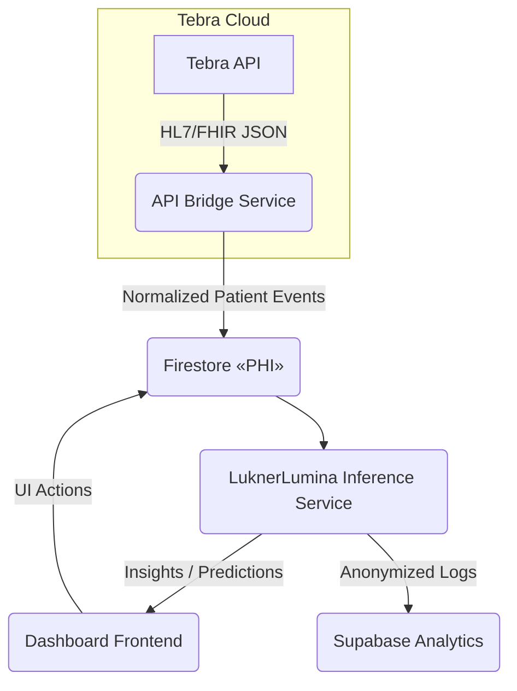

# LuknerLumina ↔️ EHR Integration Design

**Author:** Claude o3 MAX • **Date:** 2025-07-03

## 1  Objective

Integrate the new AI analytics module **LuknerLumina** into the existing Patient Flow Management stack, enabling real-time insights from Tebra EHR data while maintaining full HIPAA compliance.

## 2  High-Level Architecture

1. **API Bridge Service** (existing `functions/src/tebra-sync` logic) fetches schedule & patient updates from Tebra's REST endpoints every 5 min.
2. Data stored in **Firestore** (encrypted at rest); triggers Cloud Function to push patient-event JSON to **LuknerLumina**.
3. **LuknerLumina** (container on Cloud Run) processes events, returns predictions (e.g., no-show risk, wait-time estimates).
4. Predictions cached in Redis (Memorystore) for the React dashboard to render instantly.
5. De-identified metrics written asynchronously to **Supabase** for long-term analytics.

## 3  Key Components & Responsibilities

| Component | Stack | Responsibility |
|-----------|-------|----------------|
| API Bridge | Node 20, Cloud Functions | Pull/push data between Tebra API and Firestore; publish Redis Stream `patient_events` |
| LuknerLumina Service | Python 3.12, Cloud Run, FastAPI | Load AI models, consume `patient_events`, emit `patient_insights` stream |
| Redis Streams | Memorystore, HIPAA tier | Real-time event bus between services |
| Supabase Analytics | Postgres | Store aggregated, de-identified usage & performance data |
| Dashboard Client | React 18, SWR | Subscribe to `patient_insights` via WebSocket, update UI |

## 4  Security & Compliance

1. **PHI Isolation** – Only Firestore and Redis hold PHI; Supabase receives de-identified aggregates.
2. **Encryption in Transit** – gRPC/HTTPS with TLS 1.3 for all service calls.
3. **Service Accounts** – Principle of least privilege enforced via IAM.
4. **Audit Trails** – Redis Streams mirrored nightly to Supabase for immutable logs.

## 5  Data Flow Details

1. Cloud Scheduler triggers `pullTebraSchedules()`.
2. Raw schedule JSON passed through `parseScheduleAdvanced` → produces normalized `PatientEvent` objects.
3. Events stored in `patients/{date}/{patientId}` collection; Cloud Function `onPatientWrite` publishes to Redis.
4. LuknerLumina subscribes to `patient_events`; performs inference; pushes results to `patient_insights`.
5. Dashboard connects to Socket service (`/realtime`) that tails `patient_insights` and updates UI.

## 6  Deployment Plan

| Step | Owner | Tool | Notes |
|------|-------|------|-------|
| Create Redis streams & ACL | Infra | Terraform | Streams: `patient_events`, `patient_insights` |
| Extend tebra-sync | o3 MAX | TypeScript | Publish to Redis after Firestore write |
| Build LuknerLumina image | ML Team | Cloud Build | Containerise FastAPI service |
| Set up Pub/Sub fallback | DevOps | GCP Pub/Sub | For DR if Redis down |
| Update Dashboard hooks | Frontend | React SWR | Subscribe to insights endpoint |

## 7  Risks & Mitigations

| Risk | Impact | Mitigation |
|------|--------|-----------|
| Redis outage | UI loses realtime insights | Fallback to last prediction stored in Firestore; alerting in place |
| PHI leakage | Compliance breach | Strict IAM, env-segregated secrets, de-identification layer |
| Model drift | Inaccurate predictions | Weekly retraining pipeline |

## 8  Next Actions

1. **Finalize IAM roles** for API Bridge → Redis.
2. **Prototype LuknerLumina service** (health endpoint + dummy prediction).
3. **Extend tebra-sync tests** to cover Redis publication.
4. **Schedule security review** before production rollout.

---

*End of proposal.*
