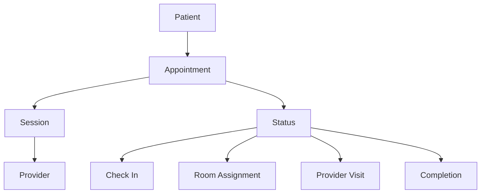
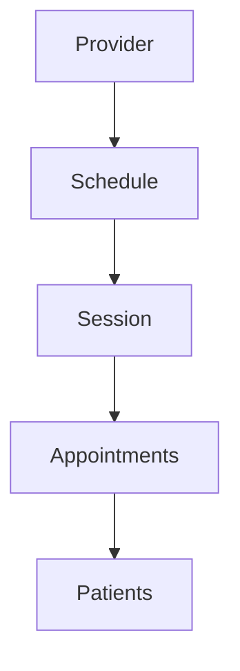

# Data Model Documentation

This document details the data models used in the Tebra EHR Integration system, including their relationships, constraints, and usage patterns.

## Core Data Models

### 1. Patient Model

```typescrip
interface Patient {
  id: string;                 // Unique identifier
  name: string;               // Full name
  dob: string;                // Date of birth (ISO format)
  appointmentTime: string;    // ISO datetime
  appointmentType: AppointmentType;
  provider: string;           // Provider name
  status: PatientStatus;
  checkInTime?: string;       // Optional ISO datetime
  room?: string;              // Optional room assignmen
}

```

#### Relationships

- One-to-many with Appointments

- One-to-one with Insurance

- Many-to-one with Provider

### 2. Appointment Model

```typescrip
interface Appointment {
  id: string;                 // Unique identifier
  patientId: string;          // Reference to Patien
  providerId: string;         // Reference to Provider
  startTime: string;          // ISO datetime
  endTime: string;            // ISO datetime
  type: AppointmentType;
  status: AppointmentStatus;
  notes?: string;             // Optional notes
  createdAt: string;          // ISO datetime
  updatedAt: string;          // ISO datetime
}

```

#### Relationships

- Many-to-one with Patien

- Many-to-one with Provider

- One-to-one with Session

### 3. Provider Model

```typescrip
interface Provider {
  id: string;                 // Unique identifier
  firstName: string;
  lastName: string;
  title: string;              // e.g., "Dr.", "NP"
  specialties: string[];      // Array of specialties
  schedule: Schedule;         // Weekly schedule
  createdAt: string;          // ISO datetime
  updatedAt: string;          // ISO datetime
}

```

#### Relationships

- One-to-many with Appointments

- One-to-many with Patients

- One-to-one with Schedule

### 4. Session Model

```typescrip
interface Session {
  id: string;                 // Unique identifier
  date: string;               // ISO date
  providerId: string;         // Reference to Provider
  appointments: Appointment[]; // Array of appointments
  status: SessionStatus;
  createdAt: string;          // ISO datetime
  updatedAt: string;          // ISO datetime
}

```

#### Relationships

- One-to-many with Appointments

- Many-to-one with Provider

## Enums and Types

### 1. Appointment Types

```typescrip
enum AppointmentType {
  OFFICE_VISIT = 'Office Visit',
  LABS = 'LABS',
  FOLLOW_UP = 'Follow Up',
  CONSULTATION = 'Consultation',
  PROCEDURE = 'Procedure'
}

```

### 2. Status Types

```typescrip
enum PatientStatus {
  SCHEDULED = 'scheduled',
  CHECKED_IN = 'checked_in',
  IN_ROOM = 'in_room',
  WITH_PROVIDER = 'with_provider',
  COMPLETED = 'completed',
  CANCELLED = 'cancelled'
}

enum AppointmentStatus {
  SCHEDULED = 'scheduled',
  CONFIRMED = 'confirmed',
  IN_PROGRESS = 'in_progress',
  COMPLETED = 'completed',
  CANCELLED = 'cancelled',
  NO_SHOW = 'no_show'
}

enum SessionStatus {
  SCHEDULED = 'scheduled',
  IN_PROGRESS = 'in_progress',
  COMPLETED = 'completed',
  CANCELLED = 'cancelled'
}

```

## Data Relationships

### 1. Patient Flow



### 2. Provider Schedule



## Data Validation Rules

### 1. Patient Validation

- Name: Required, max 100 characters

- DOB: Required, valid date, not in future

- Appointment Time: Required, valid datetime

- Status: Must be valid PatientStatus enum value

### 2. Appointment Validation

- Patient ID: Required, must exis

- Provider ID: Required, must exis

- Start Time: Required, valid datetime

- End Time: Required, valid datetime, after start time

- Type: Must be valid AppointmentType enum value

- Status: Must be valid AppointmentStatus enum value

### 3. Provider Validation

- First Name: Required, max 50 characters

- Last Name: Required, max 50 characters

- Title: Required, valid title

- Specialties: Array of valid specialties

- Schedule: Valid schedule objec

## Data Operations

### 1. CRUD Operations

```typescrip
interface DataOperations {
  // Create
  createPatient(patient: Patient): Promise<Patient>;
  createAppointment(appointment: Appointment): Promise<Appointment>;
  createProvider(provider: Provider): Promise<Provider>;
  createSession(session: Session): Promise<Session>;

  // Read
  getPatient(id: string): Promise<Patient>;
  getAppointment(id: string): Promise<Appointment>;
  getProvider(id: string): Promise<Provider>;
  getSession(id: string): Promise<Session>;

  // Update
  updatePatient(id: string, patient: Partial<Patient>): Promise<Patient>;
  updateAppointment(id: string, appointment: Partial<Appointment>): Promise<Appointment>;
  updateProvider(id: string, provider: Partial<Provider>): Promise<Provider>;
  updateSession(id: string, session: Partial<Session>): Promise<Session>;

  // Delete
  deletePatient(id: string): Promise<void>;
  deleteAppointment(id: string): Promise<void>;
  deleteProvider(id: string): Promise<void>;
  deleteSession(id: string): Promise<void>;
}

```

### 2. Query Operations

```typescrip
interface QueryOperations {
  // Find by criteria
  findPatients(criteria: PatientCriteria): Promise<Patient[]>;
  findAppointments(criteria: AppointmentCriteria): Promise<Appointment[]>;
  findProviders(criteria: ProviderCriteria): Promise<Provider[]>;
  findSessions(criteria: SessionCriteria): Promise<Session[]>;

  // Get related data
  getPatientAppointments(patientId: string): Promise<Appointment[]>;
  getProviderAppointments(providerId: string): Promise<Appointment[]>;
  getSessionAppointments(sessionId: string): Promise<Appointment[]>;
}

```

## Data Migration

### 1. Version Control

- Each model version is tracked

- Migration scripts are provided

- Rollback procedures documented

- Data validation on migration

### 2. Backup Strategy

- Regular automated backups

- Point-in-time recovery

- Data integrity checks

- Backup verification

## Performance Considerations

### 1. Indexing Strategy

- Primary keys on all models

- Foreign key indexes

- Composite indexes for common queries

- Text search indexes

### 2. Caching Strategy

- In-memory caching

- Query result caching

- Cache invalidation rules

- Cache size limits

## Security Considerations

### 1. Data Access Control

- Role-based access

- Field-level security

- Audit logging

- Data encryption

### 2. Data Privacy

- PHI handling

- Data masking

- Retention policies

- Compliance requirements
