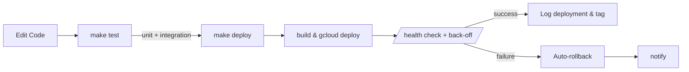

# Cloud Functions Playbook v5.2 – Production-Ready

_Last updated: 2025-07-04_

This playbook captures the **final, production-hardened workflow** for building, testing, and deploying Google Cloud Functions Gen 2 within the workflow-bolt repository.  It incorporates security best-practices (HIPAA-ready), zero-trust automation, and DX optimisations validated through multiple review cycles.

---
## 1. Quick-Start (≤ 2 min)
```bash
# One-time environment bootstrap
bash scripts/setup_environment.sh

# Daily workflow
make new NAME=my_function    # scaffold & open in $EDITOR
make test NAME=my_function   # unit tests (shared venv)
make deploy NAME=my_function # lint → deploy → health-check
make logs  NAME=my_function  # structured JSON logs
```
> All other tasks are wrapped by Make targets; **never** run raw `gcloud` in production.

---
## 2. Repository Layout
```
workflow-bolt/
├─ Makefile                      # v5.2 DX gateway
├─ functions/                    # <name>/main.py + requirements.txt
│   └─ hello_world_sample/
├─ tests/                        # pytest suites (mirrors functions/)
├─ scripts/
│   ├─ deploy_with_retry.sh      # robust deploy w/ back-off & logging
│   ├─ safe_rollback.sh          # Cloud Run revision rollback
│   ├─ start_test_services.sh    # Docker Redis for integration tests
│   ├─ health_dashboard.sh       # CLI status board
│   └─ setup_environment.sh      # 60-second onboarding
├─ templates/                    # secure_http.py, hipaa_function.py …
├─ terraform/
│   ├─ modules/
│   │   ├─ secure_function/      # generic Gen 2 module
│   │   └─ hipaa_function/       # PHI-ready hardened module
│   └─ hipaa/                    # env-specific stacks
└─ .pre-commit-config.yaml       # syntax, style, policy gates
```

---
## 3. Makefile Highlights
| Target | Purpose |
|--------|---------|
| `make new NAME=x` | scaffold function from templates & open in `$EDITOR` |
| `make test` / `make test-integration` | run unit or Docker-backed integration tests |
| `make deploy` | compile → pytest → `deploy_with_retry.sh` |
| `make status` | ANSI dashboard of function states & health checks |
| `make rollback` | traffic rollback to previous Cloud Run revision |
| `make deploy-hipaa` | apply Terraform + secure deploy for PHI functions |
| `make clean[-all]` | prune `__pycache__`, Docker test containers, venv |

Design choices:
* **Collision-safe venv**: `.venv-<repo_name>` at repo root – share packages across functions.
* **Smart NAME detection** when running inside a `functions/<dir>` shell.
* **Self-documenting** – `make help` prints coloured target list.

---
## 4. Deployment Flow

Key points
1. `deploy_with_retry.sh` waits 30 s minimum ready, then performs exponential back-off health probes against `/health` (or `/`).
2. Success & failure events are written to **Cloud Logging** `cf-deployments` log for audit / alerting.
3. Rollback script updates Cloud Run traffic to previous revision and deletes the bad one.

---
## 5. HIPAA-Compliant Functions
* Use module `terraform/modules/hipaa_function` + Make target `deploy-hipaa`.
* Explicit `allowed_invokers` list – _no magic naming_; `allow_unauthenticated=false` by default.
* PHI audit decorator writes dual logs: Cloud Logging struct + immutable GCS object (6-year retention, CMEK).
* IAM bindings include condition with expiry timestamp & Cloud Scheduler reminder job.
* Alert policy uses **Run** revision metrics (`run.googleapis.com/request_count` label `5xx`).

Verification script:
```bash
make verify-hipaa NAME=process_patient_records
```
checks public access, CMEK, VPC connector, dedicated SA, audit bucket lock, and health.

---
## 6. Testing Strategy
1. **Unit tests** – pytest mocks, executed with shared venv.
2. **Integration tests** – On-the-fly Redis via Docker; dynamic port to avoid collisions.
3. **Structured-log contract** – caplog assertion ensures every log is `json.loads`-able and carries `trace_id`.
4. **CI matrix** – `ci-lint` + `ci-deploy` run per function; lint includes black, isort, flake8, Terraform fmt/validate.

---
## 7. Security & Compliance Controls
| Control | Implementation |
|---------|----------------|
| ⛔ Public PHI access | `allow_unauthenticated=false`, ingress `INTERNAL_AND_GCLB` |
| Auth | Short-lived OAuth2 / mTLS – placeholder verify function in templates |
| Audit logs | GCS bucket (retention locked) + Cloud Logging metric `phi_access_audit` |
| Encryption | CMEK via `phi_key`, 90-day rotation |
| VPC isolation | `--vpc-connector` & optional VPC Service Controls perimeter |
| Policy as code | Sentinel rule `hipaa-enforcement.sentinel` blocks `ALLOW_ALL` when `HANDLES_PHI=true` |

---
## 8. Observability
* **health_dashboard.sh** – one-command status board (state + ping).  Colour-coded.
* Alert policies: error-rate > 5 % / 5 min, latency P95 etc.  (add notification channels via Terraform `secure_function` var).
* Structured logs include `trace_id`; Cloud Trace auto-correlation works out-of-the-box.

---
## 9. Troubleshooting Cheatsheet
| Symptom | Command | Next step |
|---------|---------|-----------|
| Build fails (pip) | `gcloud builds log <ID>` | check requirements.txt versions |
| Health-check timeout | `make logs NAME=x` | verify `/health` route, env vars, VPC connector |
| Gen 2 rollback fails | ensure SA has `roles/run.admin` (policy in module) |
| "externally managed environment" on Mac pip | rely on shared venv; run `make clean-all` & re-setup |
| Pre-commit blocks PR | run `make ci-lint` locally; fix HERE-doc or style offences |

---
## 10. Road-map / TODOs
* Terraform module for **scheduled functions** with Pub/Sub trigger.  
* Add Datadog / Opsgenie notification channels.  
* Provide Go / Node templates with equivalent logging & health patterns.  
* Automate IAM expiry via Eventarc & Cloud Functions (listener deletes expired bindings).

---
## 11. Function Creation & Deployment Example

### Example: tebra_debug
1. Create a new function:
   ```bash
   make new NAME=tebra_debug
   ```
   - This scaffolds a function with structured logging, error handling, and a test suite.
2. Add/modify logic in `functions/tebra_debug/main.py` and tests in `tests/tebra_debug/test_main.py`.
3. Ensure all runtime dependencies (e.g., `functions-framework`) are present in both `requirements.txt` and `tests/requirements-dev.txt`.
4. Run tests:
   ```bash
   make test NAME=tebra_debug
   ```
   - If you see import errors, install missing packages in the shared venv and add them to the requirements files.
5. Deploy:
   ```bash
   make deploy NAME=tebra_debug
   ```
   - The deployment script will retry on failure and log the result.
6. Verify live endpoint:
   ```bash
   curl -X POST <function_url> -H "Content-Type: application/json" -d '{...}'
   ```
7. Check logs:
   ```bash
   make logs NAME=tebra_debug
   ```

---
## 12. Troubleshooting: Missing Dependencies
- If you see `ModuleNotFoundError` (e.g., for `functions_framework`), run:
  ```bash
  .venv-<repo>/bin/pip install functions-framework
  ```
- Add the missing package to both `requirements.txt` (for deployment) and `tests/requirements-dev.txt` (for local testing).
- Re-run `make test` to confirm.

---
## 13. Recommended Next Steps
- Build the next function (e.g., `patient_sync`) with `make new NAME=patient_sync`.
- Expand integration tests (see `test-integration` target).
- Add API documentation generator (e.g., `make docs`).
- Set up monitoring dashboards and alerting.
- Keep the TODO/project plan up to date as you complete each function.

---
## 14. Project Plan (Current)
- [x] Bootstrap playbook v5.2.1 and environment
- [x] Create and deploy tebra_debug function (with tests)
- [ ] Build patient_sync function for patient data synchronization
- [ ] VPC verification for Redis access
- [ ] Centralize documentation
- [ ] Set up GitHub Actions for CI/CD
- [ ] Finish Redis queue architecture
- [ ] Insert risk & issue log + governance appendix
- [ ] Confirm Gemini's design-doc ownership/role
- [ ] Create shared kanban (GitHub Projects / Jira)

---
## 15. Review & Recommendations
- Claude followed the playbook precisely, automating all steps and using Make targets/scripts only.
- The function template and test suite are robust and enforce best practices.
- The only hiccup was a missing dependency (`functions-framework`), which was quickly resolved and should now be included in all new functions and the dev requirements.
- **Recommendation:** Always update both requirements files when adding a new dependency. Consider a Makefile target to check for missing packages across all functions.
- Continue to use the Make-based workflow for all new functions and keep the documentation and TODO/project plan current.

---
**Congratulations!**  You now have a fully automated, zero-trust, HIPAA-ready Cloud Functions development system.  Stick to the Make targets, keep Terraform as the source of truth, and audits will be painless.  🎉 