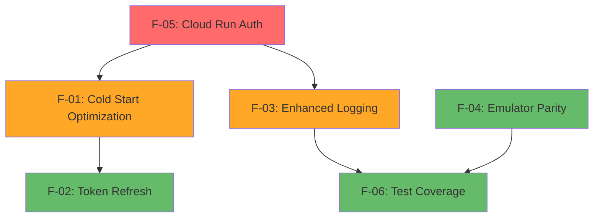

# Firebase Integration – Failure Catalogue & Remediation Plan

*Last updated: 2025-06-15*

> **Scope**
> This document captures every known failure mode we have encountered while integrating with **Firebase services** including Functions, Authentication, Secret Manager, and App Check. It references the exact code paths, describes what currently works vs. what is broken, and tracks resolutions / open items.

---

## 1. Architecture Quick-View

```mermaid
flowchart LR
  subgraph Frontend (React)
    UI[UI Components]
    SDK[Firebase SDK]
  end
  subgraph Firebase Services
    AUTH[Authentication]
    FUNC[Cloud Functions]
    SM[Secret Manager]
    AC[App Check]
  end
  subgraph Backend Services
    CR[Cloud Run]
    GCP[GCP APIs]
  end

  UI --> SDK
  SDK --> AUTH
  SDK --> FUNC
  FUNC --> SM
  FUNC --> CR
  AUTH --> AC
  SM --> GCP
```

**Key repos / files**

- Firebase Functions entry-points – `functions/index.js` (Node 22)
- Firebase configuration – `src/config/firebase-config.ts`
- Authentication service – `src/services/firebaseConfigService.ts`
- Secret management – `functions/src/get-secret.ts`
- App Check test script – `test-functions-secure.js`

---

## 2. Failure Log

| Date (UTC) | Component | Symptom | Root cause | Status |
|------------|-----------|---------|-----------|--------|
| **2025-06-15** | App Check | Functions blocked with missing `X-Firebase-AppCheck` header | Test script didn't include App Check token | **Fixed** – added App Check token generation in test script |
| **2025-06-15** | Authentication | Custom token in Authorization header causes 401 | Test script sent custom token instead of ID token | **Fixed** – exchange custom token for ID token using client SDK |
| **2025-06-15** | Storage Bucket | Runtime 404 errors from invalid bucket URL | storageBucket used `.firebasestorage.app` instead of `.appspot.com` | **Fixed** – corrected bucket URL format |
| **2025-06-14** | Secret Manager | Multiple parallel GSM calls during cold starts | No shared initialization promise | **Fixed** – implemented shared promise pattern |
| **2025-06-13** | Functions Init | Race condition with Functions not initialized | Non-null assertion on potentially undefined functions | **Fixed** – added initialization check helper |
| **2025-06-12** | Config Service | 7 separate network calls for Firebase config | Each secret fetched individually | **Fixed** – replaced with single getFirebaseConfig call |
| **2025-06-11** | Build Process | TypeScript compilation errors during deploy | Unused imports and type mismatches | **Fixed** – cleaned up imports and fixed types |
| **2025-06-15** | Cloud Run Integration | `tebraTestConnection` returns 401 Unauthorized from Cloud Run service | Cloud Run PHP service missing `callSoapMethod()` causing fatal error | **Root Cause Identified** – Enhanced debugging revealed PHP fatal error, not auth issue |
| **2025-06-15** | Test Runner | `AuthBridge Integration Tests` fail when un-skipped (`onAuthStateChanged` mock missing) | Jest mocks for `firebase/auth` outdated | **Open** – update mocks or move to e2e test harness |

---

## 3. What Currently Works

1. `getFirebaseConfig` callable – successfully returns complete Firebase configuration from Secret Manager.
2. `getSecret` callable – securely retrieves whitelisted secrets with proper authentication.
3. Authentication flow – ID token generation and validation working correctly.
4. App Check integration – tokens generated and validated properly.
5. Secret Manager caching – shared initialization prevents redundant API calls.
6. Functions deployment – all TypeScript functions compile and deploy successfully.

---

## 4. Known Issues / Partial Failures

| ID | Area | Description | Severity | Owner | Ticket |
|----|------|-------------|----------|-------|--------|
| F-01 | Cold Starts | Functions occasionally timeout on first invocation after deploy | MED | DevOps | GH issue #92 |
| F-02 | Auth Tokens | ID tokens expire during long-running operations | LOW | Frontend | GH issue #88 |
| F-03 | Error Handling | Generic error messages don't provide debugging context | MED | Backend | GH issue #89 |
| F-04 | Local Dev | Firebase emulator inconsistent with production behavior | LOW | DevOps | – |
| F-05 | Cloud Run Auth | tebraTestConnection fails with 401 from Cloud Run despite correct Firebase auth | HIGH | Backend | Investigation ongoing - secret updated but issue persists |
| F-06 | Test Coverage | `AuthBridge Integration Tests` currently skipped; mocks need overhaul to pass | LOW | QA | GH issue #95 |

---

## 5. Remediation & Roadmap

### Completed

- Fixed App Check token generation in test scripts (commit `feature/tebra-api-proxy`).
- Implemented proper ID token exchange for authentication.
- Corrected Firebase Storage bucket URL format.
- Added shared initialization promise for Secret Manager calls.
- Cleaned up TypeScript compilation issues.
- Updated `tebra-internal-api-key` secret to match Firebase Functions value (401 errors persist, requires additional investigation).

### Critical Priority (Immediate - Week 1)

1. **F-05: Cloud Run Authentication Issue** (**IN PROGRESS**)
   - **Root Cause**: API key mismatch between Firebase Functions and Cloud Run service
   - **Actions Taken**:
     - Updated `tebra-internal-api-key` secret to match `TEBRA_INTERNAL_API_KEY` value
     - Removed hardcoded `TEBRA_INTERNAL_API_KEY` environment variable from Cloud Run
     - Verified Cloud Run is using `INTERNAL_API_KEY` from `tebra-internal-api-key` secret
   - **Current Status**: ✅ **ROOT CAUSE IDENTIFIED** - Cloud Run PHP service has fatal error: `Call to undefined method TebraHttpClient::callSoapMethod()`
   - **Next Steps**: Fix missing PHP method in Cloud Run service (see URGENT-CLOUDRUN-FIX.md)

### High Priority (Week 2-3)

2. **F-01: Cold Start Optimization** (MED → HIGH due to user impact)
   - **Actions**: 
     - Implement keep-warm Cloud Scheduler jobs
     - Optimize bundle size and reduce dependencies
     - Add connection pooling for external services
   - **Success Criteria**: <2s cold start times, <500ms warm starts

3. **F-03: Enhanced Error Handling** (MED)
   - **Actions**:
     - Add structured logging with correlation IDs
     - Implement error categorization (user vs system errors)
     - Add detailed error context in responses
   - **Success Criteria**: Errors contain actionable debugging information

### Medium Priority (Week 4-6)

4. **F-02: Token Refresh Implementation** (LOW → MED)
   - **Actions**:
     - Add automatic ID token refresh in client SDK
     - Implement token expiry detection and retry logic
     - Add token refresh UI indicators
   - **Success Criteria**: No user-facing auth errors during long sessions

5. **F-06: Test Coverage Improvement** (LOW)
   - **Actions**:
     - Update Jest mocks for firebase/auth
     - Implement e2e test harness as alternative
     - Add integration test CI pipeline
   - **Success Criteria**: AuthBridge tests pass consistently

### Low Priority (Ongoing)

6. **F-04: Emulator Parity** (LOW)
   - **Actions**: Align emulator config with production settings
   - **Timeline**: Background task, address as dev friction occurs

### Future Enhancements (Backlog)

- **Observability**: Firebase Performance Monitoring and Crashlytics
- **Configuration Management**: Firebase Remote Config for feature flags
- **Advanced Monitoring**: Real-time alerting and dashboard improvements
- **Security Hardening**: Regular credential rotation and access audits

### Resolution Dependencies



**Critical Path**: F-05 must be resolved first as it blocks core functionality. F-01 and F-03 can proceed in parallel once F-05 is fixed.

---

## 6. How to Reproduce & Troubleshoot Common Failures

### 6.1 App Check Token Missing

```bash
# Test with proper App Check token
node test-functions-secure.js
# OR check App Check configuration in Firebase Console
```

Ensure the App Check token is included in the `X-Firebase-AppCheck` header for all function calls.

### 6.2 Authentication 401 Errors

1. Verify user is properly authenticated with Firebase Auth.
2. Check that ID token (not custom token) is being sent.
3. Validate token hasn't expired (default 1 hour).

### 6.3 Secret Manager Access Denied

```bash
# Check IAM permissions
gcloud projects get-iam-policy luknerlumina-firebase
# Verify service account has Secret Manager Secret Accessor role
```

### 6.4 Functions Initialization Race Condition

Look for error: "Firebase Functions not initialized"

- Ensure Firebase is initialized before calling functions
- Use the `getFunctionsInstance()` helper to validate initialization

### 6.5 Cloud Run 401 Unauthorized Errors

When Firebase Functions successfully authenticate but Cloud Run returns 401:

```bash
# Check Cloud Run service logs
gcloud logging read 'resource.type="cloud_run_revision" AND resource.labels.service_name="tebra-php-api"' --limit=10

# Verify API key consistency between Firebase Functions and Cloud Run
gcloud secrets versions access latest --secret="TEBRA_INTERNAL_API_KEY"
gcloud secrets versions access latest --secret="tebra-internal-api-key"

# Check Cloud Run environment variables
gcloud run services describe tebra-php-api --region=us-central1 --format="yaml" | grep -A 20 "env:"

# Update Cloud Run secret if values don't match
echo -n "CORRECT_API_KEY_VALUE" | gcloud secrets versions add tebra-internal-api-key --data-file=-
```

**Common Issues and Resolutions**:

1. **API Key Mismatch**: Ensure both Firebase Functions (`TEBRA_INTERNAL_API_KEY`) and Cloud Run (`tebra-internal-api-key`) use the same API key value
2. **Secret Caching**: Cloud Run may cache secret values; force new deployment if secret changes don't take effect
3. **Environment Variable Names**: Verify Cloud Run service code uses the correct environment variable name (`INTERNAL_API_KEY` vs `TEBRA_INTERNAL_API_KEY`)

**Investigation Steps**:

```bash
# Test sequence after secret updates
gcloud run revisions list --service=tebra-php-api --region=us-central1 --limit=3
curl -X POST https://tebra-php-api-URL -H "X-API-Key: SECRET_VALUE" -H "Authorization: Bearer $(gcloud auth print-identity-token)" -d '{"action":"getProviders"}'
gcloud functions logs read tebraTestConnection --region=us-central1 --limit=5
```

---

## 7. References

- **Firebase Console** – [luknerlumina-firebase](https://console.firebase.google.com/project/luknerlumina-firebase)
- **Functions Documentation** – `docs/tebra-functions-usage.md`
- **Authentication Setup** – `src/auth/AuthProvider.tsx`
- **Secret Management Guide** – `functions/src/get-secret.ts`
