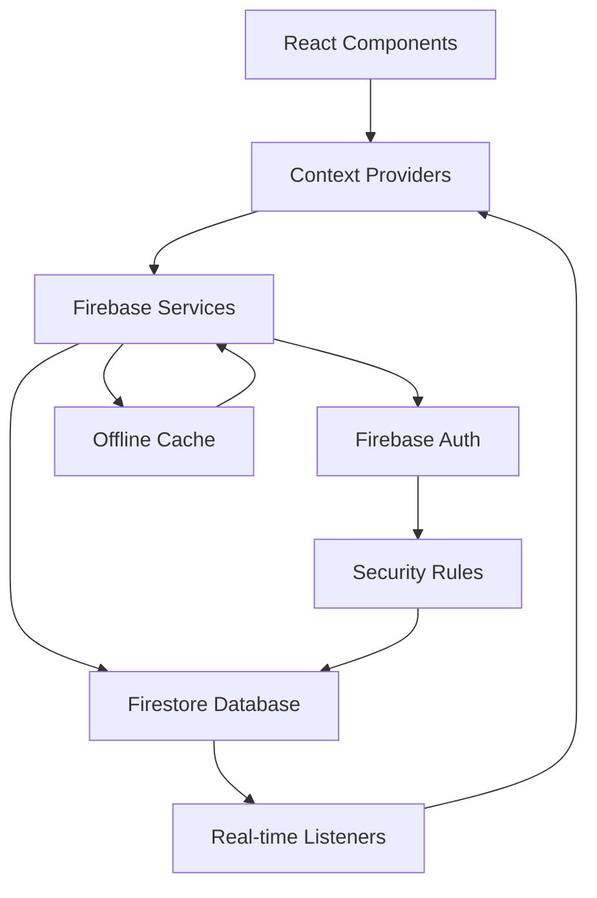
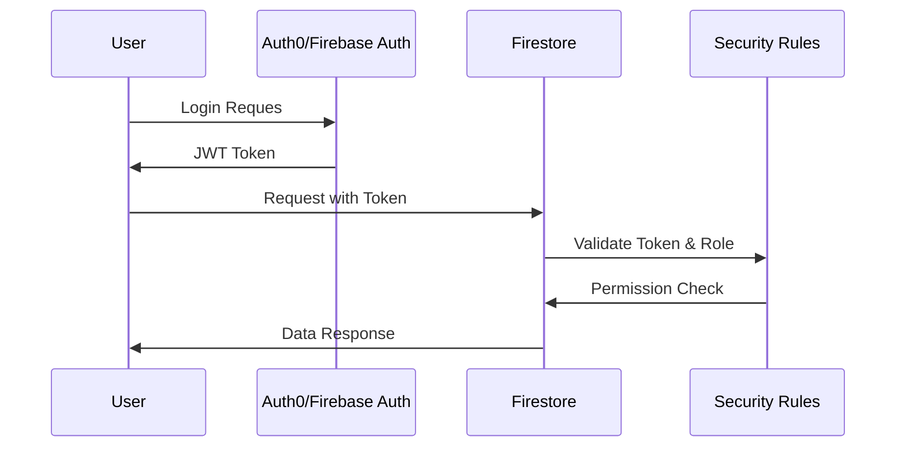
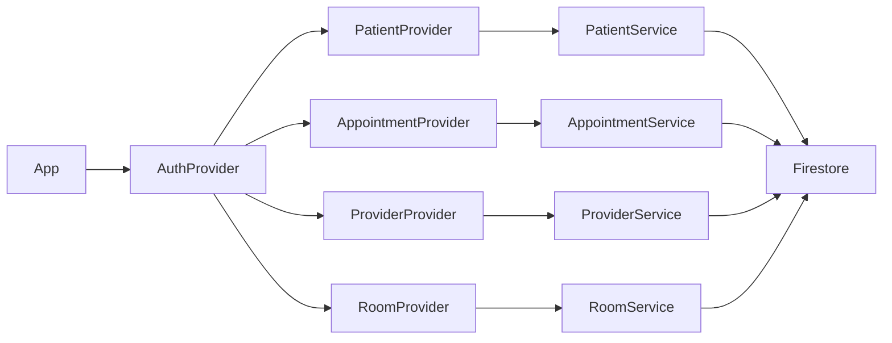
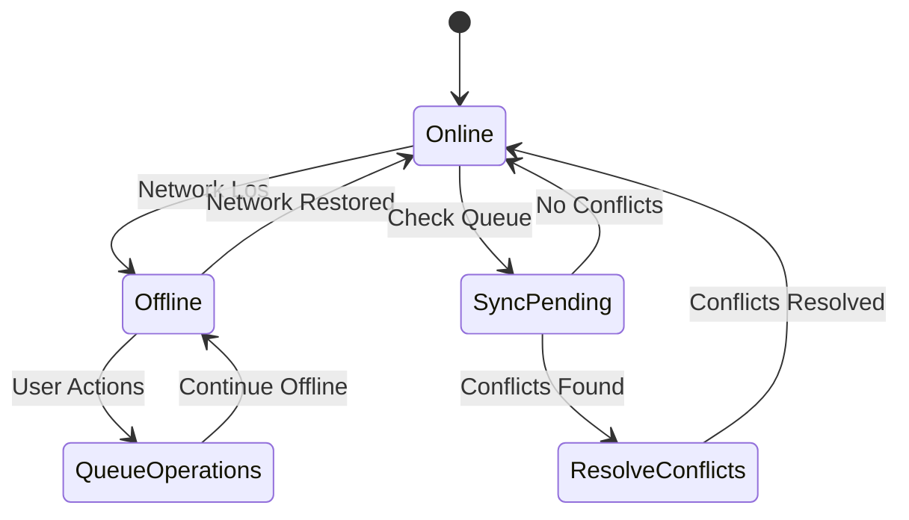

# Firebase Data Persistence Implementation Plan

## Overview

This plan outlines the implementation of Firebase Firestore for data persistence
in the Patient Flow Management System, replacing the current in-memory state
management with cloud-based storage.

## Phase 1: Firebase Configuration & Setup ✅ (Completed)

- [x] Install Firebase dependencies

- [x] Create Firebase configuration file

- [x] Set up environment variables for Firebase config

- [x] Initialize Firestore and Auth services

- [x] Create basic patient service structure

## Phase 2: Data Model Design & Schema

### 2.1 Firestore Collections Structure

```typescrip
/patients/{patientId}
  - id: string
  - firstName: string
  - lastName: string
  - dateOfBirth: Timestamp
  - email?: string
  - phone?: string
  - appointmentTime: Timestamp
  - provider: string
  - status: PatientApptStatus
  - room?: string
  - checkInTime?: Timestamp
  - withDoctorTime?: Timestamp
  - completedTime?: Timestamp
  - createdAt: Timestamp
  - updatedAt: Timestamp

/appointments/{appointmentId}
  - id: string
  - patientId: string
  - providerId: string
  - scheduledTime: Timestamp
  - duration: number
  - type: string
  - status: string
  - notes?: string
  - createdAt: Timestamp
  - updatedAt: Timestamp

/providers/{providerId}
  - id: string
  - name: string
  - specialty: string
  - isActive: boolean
  - schedule?: objec
  - createdAt: Timestamp
  - updatedAt: Timestamp

/rooms/{roomId}
  - id: string
  - name: string
  - type: string
  - isAvailable: boolean
  - equipment?: string[]
  - createdAt: Timestamp
  - updatedAt: Timestamp

```

### 2.2 Security Rules Design

#### Role-Based Access Control

The system implements three primary user roles:

- **Admin**: Full access to all collections and operations

- **Provider**: Access to patients and appointments assigned to them

- **Staff**: Read access to patients, limited write access for status updates

#### Sample Firestore Security Rules

```javascrip
rules_version = '2';
service cloud.firestore {
  match /databases/{database}/documents {
    // Helper functions
    function isAuthenticated() {
      return request.auth != null;
    }

    function getUserRole() {
      return get(/databases/$(database)/documents/users/$(request.auth.uid)).data.role;
    }

    function isAdmin() {
      return isAuthenticated() && getUserRole() == 'admin';
    }

    function isProvider() {
      return isAuthenticated() && getUserRole() == 'provider';
    }

    function isStaff() {
      return isAuthenticated() && getUserRole() == 'staff';
    }

    // Patients collection
    match /patients/{patientId} {
      // Admins have full access
      allow read, write: if isAdmin();

      // Providers can read/write patients assigned to them
      allow read, write: if isProvider() &&
        resource.data.provider == request.auth.uid;

      // Staff can read all patients, update status only
      allow read: if isStaff();
      allow update: if isStaff() &&
        request.resource.data.diff(resource.data).affectedKeys()
        .hasOnly(['status', 'checkInTime', 'withDoctorTime', 'completedTime', 'updatedAt']);
    }

    // Appointments collection
    match /appointments/{appointmentId} {
      allow read, write: if isAdmin();
      allow read, write: if isProvider() &&
        resource.data.providerId == request.auth.uid;
      allow read: if isStaff();
    }

    // Providers collection
    match /providers/{providerId} {
      allow read, write: if isAdmin();
      allow read: if isProvider() || isStaff();
      allow update: if isProvider() && providerId == request.auth.uid;
    }

    // Rooms collection
    match /rooms/{roomId} {
      allow read: if isAuthenticated();
      allow write: if isAdmin() || isStaff();
    }

    // User profiles
    match /users/{userId} {
      allow read, write: if isAdmin();
      allow read, update: if request.auth.uid == userId;
    }
  }
}

```

#### HIPAA Compliance Considerations

- All data access is logged and auditable

- Minimum necessary access principle enforced

- Data encryption in transit and at res

- User authentication required for all operations

- Role-based permissions prevent unauthorized access

## Phase 3: Service Layer Implementation

### 3.1 Enhanced Patient Service

- [x] Basic CRUD operations (created)

- [ ] Real-time subscriptions for live updates

- [ ] Batch operations for bulk updates

- [ ] Advanced querying (by status, provider, date range)

- [ ] Pagination for large datasets

- [ ] Error handling and retry logic

### 3.2 Additional Services

- [ ] Appointment Service

- [ ] Provider Service

- [ ] Room Management Service

- [ ] Analytics/Metrics Service

- [ ] Audit Log Service

### 3.3 Offline Suppor

- [ ] Enable Firestore offline persistence

- [ ] Handle offline/online state transitions

- [ ] Implement conflict resolution strategies

#### Conflict Resolution Strategy

##### Primary Model: Last-Write-Wins with Timestamp Validation

The system uses a hybrid approach combining last-write-wins with intelligen
conflict detection:

1. **Timestamp-Based Resolution**

   - All documents include `updatedAt` timestamp
   - Server timestamp takes precedence over client timestamp
   - Conflicts resolved by comparing server-side timestamps

2. **Field-Level Conflict Detection**

   ```typescrip
   interface ConflictResolution {
     strategy: "last-write-wins" | "merge" | "manual";
     conflictFields: string[];
     resolution: "server" | "client" | "merge";
     timestamp: Timestamp;
   }
   ```

3. **Critical Field Protection**

   - Patient status changes require server validation
   - Appointment times cannot be modified offline
   - Provider assignments need admin approval

4. **Edge Case Handling**

   - **Simultaneous Status Updates**: Server timestamp wins, client notified
   - **Offline Patient Creation**: Temporary ID until server sync
   - **Network Partition**: Queue operations, sync on reconnection
   - **Data Corruption**: Fallback to last known good state

5. **Conflict Resolution Workflow**

   ```tex
   1. Detect conflict during sync
   2. Compare timestamps and field changes
   3. Apply resolution strategy
   4. Notify user if manual intervention needed
   5. Log conflict for audit trail
   ```

6. **User Notification System**
   - Real-time alerts for critical conflicts
   - Batch notifications for minor conflicts
   - Detailed conflict logs for administrators

## Phase 4: Context Integration

### 4.1 PatientContext Migration

- [ ] Replace local state with Firebase operations

- [ ] Implement real-time listeners

- [ ] Add loading states for async operations

- [ ] Error handling and user feedback

- [ ] Optimistic updates for better UX

### 4.2 New Context Providers

- [ ] AppointmentContex

- [ ] ProviderContex

- [ ] RoomContex

- [ ] AuthContext (if not using Auth0)

## Phase 5: Authentication & Authorization

### 5.1 Firebase Auth Integration

- [ ] Evaluate Firebase Auth vs current Auth0 setup

- [ ] Implement user roles and permissions

- [ ] Set up custom claims for role-based access

- [ ] Session managemen

### 5.2 Security Implementation

- [ ] Firestore Security Rules

- [ ] Data validation rules

- [ ] Rate limiting

- [ ] Audit logging

## Phase 6: Real-time Features

### 6.1 Live Updates

- [ ] Real-time patient status updates

- [ ] Live dashboard metrics

- [ ] Room availability updates

- [ ] Provider schedule changes

### 6.2 Notifications

- [ ] Patient status change notifications

- [ ] Appointment reminders

- [ ] System alerts

## Phase 7: Data Migration & Import/Expor

### 7.1 Data Migration

- [ ] Migrate existing mock data to Firestore

- [ ] Data validation and cleanup

- [ ] Backup and restore procedures

### 7.2 Enhanced Import/Expor

- [ ] Bulk import from various formats (CSV, JSON, HL7)

- [ ] Export to different formats

- [ ] Scheduled backups

- [ ] Data archiving strategies

## Phase 8: Performance Optimization

### 8.1 Query Optimization

- [ ] Implement proper indexing

- [ ] Optimize compound queries

- [ ] Use query cursors for pagination

- [ ] Cache frequently accessed data

### 8.2 Bundle Optimization

- [ ] Tree-shake unused Firebase features

- [ ] Implement code splitting for Firebase modules

- [ ] Optimize bundle size

## Phase 9: Monitoring & Analytics

### 9.1 Firebase Analytics

- [ ] Set up Firebase Analytics

- [ ] Track user interactions

- [ ] Monitor performance metrics

- [ ] Error tracking and reporting

### 9.2 Custom Metrics

- [ ] Patient flow analytics

- [ ] Wait time analysis

- [ ] Provider efficiency metrics

- [ ] System usage statistics

## Phase 10: Testing & Quality Assurance

### 10.1 Unit Testing

- [ ] Test Firebase service functions

- [ ] Mock Firebase for testing

- [ ] Test error scenarios

- [ ] Validate data transformations

### 10.2 Integration Testing

- [ ] Test real-time updates

- [ ] Test offline scenarios

- [ ] Test security rules

- [ ] Performance testing

## Phase 11: Documentation & Training

### 11.1 Technical Documentation

- [ ] API documentation

- [ ] Database schema documentation

- [ ] Security guidelines

- [ ] Deployment procedures

- [ ] Architectural diagrams and workflow visuals

#### Architectural Diagrams

##### Data Flow Diagram



##### Authentication Flow Char



##### Context Provider Relationships



##### Offline Sync Workflow



### 11.2 User Documentation

- [ ] User guides for new features

- [ ] Admin documentation

- [ ] Troubleshooting guides

- [ ] Role-based access guides

- [ ] Offline mode instructions

#### Visual Documentation Requirements

1. **Component Hierarchy Diagrams**

   - Show React component tree structure
   - Highlight data flow between components
   - Document prop passing patterns

2. **Database Schema Visuals**

   - Entity relationship diagrams
   - Collection structure charts
   - Index optimization guides

3. **Security Model Diagrams**

   - Role permission matrices
   - Data access flow charts
   - Audit trail visualizations

4. **Deployment Architecture**
   - Infrastructure diagrams
   - CI/CD pipeline visuals
   - Environment configuration charts

## Implementation Priority

### High Priority (Phase 1-4)

1. Complete Firebase setup and configuration
2. Implement enhanced patient service with real-time updates
3. Migrate PatientContext to use Firebase
4. Basic security rules implementation

### Medium Priority (Phase 5-7)

1. Authentication and authorization
2. Real-time features and notifications
3. Data migration and enhanced import/expor

### Low Priority (Phase 8-11)

1. Performance optimization
2. Advanced analytics
3. Comprehensive testing
4. Documentation

## Technical Considerations

### Data Consistency

- Use Firestore transactions for critical operations

- Implement optimistic locking where needed

- Handle concurrent updates gracefully

### Scalability

- Design for horizontal scaling

- Implement efficient pagination

- Use subcollections for related data

### Cost Optimization

- Monitor Firestore usage and costs

- Implement data retention policies

- Optimize query patterns to reduce reads

### Compliance

- Ensure HIPAA compliance for healthcare data

- Implement proper data encryption

- Set up audit trails for sensitive operations

## Success Metrics

- Zero data loss during migration

- < 2 second response time for common operations

- 99.9% uptime for real-time features

- Successful handling of concurrent users

- Compliance with healthcare data regulations

## Risk Mitigation

- Implement comprehensive backup strategies

- Set up monitoring and alerting

- Create rollback procedures

- Maintain data validation at multiple layers

- Regular security audits
