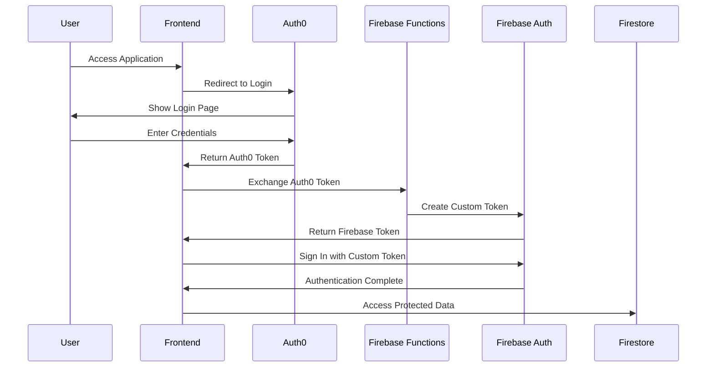

# CORS and Authentication Architecture Design

## Overview

This document describes the authentication flow and CORS (Cross-Origin Resource Sharing) configuration for the Tebra EHR Integration application. It covers the design decisions, security considerations, and implementation details for handling authentication and cross-origin requests.

## Authentication Flow

### 1. Multi-Stage Authentication Process

The application implements a multi-stage authentication process to ensure HIPAA compliance and secure access to PHI (Protected Health Information):



### 2. Token Exchange Process

The token exchange is critical for bridging Auth0 authentication with Firebase services:

```typescript
// AuthBridge Token Exchange
class AuthBridge {
  async exchangeTokens(auth0Token: string): Promise<void> {
    // 1. Validate Auth0 token
    const decoded = this.validateJWT(auth0Token);
    
    // 2. Exchange for Firebase token
    const response = await fetch(exchangeAuth0TokenUrl, {
      method: 'POST',
      headers: {
        'Content-Type': 'application/json',
        'Authorization': `Bearer ${auth0Token}`
      },
      body: JSON.stringify({ token: auth0Token })
    });
    
    // 3. Sign in to Firebase
    const { firebaseToken } = await response.json();
    await signInWithCustomToken(auth, firebaseToken);
  }
}
```

### 3. Authentication Logging

The system provides detailed logging for debugging authentication issues:

- `✅ HIPAA-compliant Firebase authentication successful` - Successful authentication
- `⏱️ Token exchange completed in XXXms` - Performance metrics
- `🔍 JWT Token Debug` - Detailed token information for troubleshooting

## CORS Configuration

### 1. Firebase Functions CORS Setup

Firebase Functions require proper CORS configuration to accept requests from the frontend:

```javascript
// Firebase Function with CORS
const corsOptions = {
  origin: [
    'http://localhost:3000',
    'http://localhost:5173',
    'https://luknerlumina-firebase.web.app',
    'https://luknerlumina-firebase.firebaseapp.com'
  ],
  credentials: true,
  methods: ['GET', 'POST', 'OPTIONS'],
  allowedHeaders: ['Content-Type', 'Authorization']
};

exports.tebraProxy = onRequest({
  cors: corsOptions,
  memory: '256MiB'
}, async (req, res) => {
  // Function implementation
});
```

### 2. CORS Error Patterns

Common CORS errors and their meanings:

| Error Message | Cause | Solution |
|---------------|-------|----------|
| `Preflight response is not successful. Status code: 403` | CORS policy blocking request | Add origin to allowed list |
| `Fetch API cannot load ... due to access control checks` | Missing CORS headers | Configure CORS in function |
| `Failed to load resource: Preflight response is not successful` | OPTIONS request failed | Handle preflight requests |

### 3. CORS Security Considerations

- **HIPAA Compliance**: CORS 403 errors are expected behavior for protected endpoints
- **Origin Validation**: Only allow specific origins, never use `origin: true` in production
- **Credential Support**: Enable `credentials: true` for authenticated requests
- **Preflight Handling**: Explicitly handle OPTIONS requests for complex CORS scenarios

## Firebase Configuration

### 1. Configuration Source Hierarchy

The application uses a hierarchical approach for Firebase configuration:

1. **Backend/GSM (Primary)**: Configuration from Google Secret Manager via backend
2. **Environment Variables (Fallback)**: Local development configuration
3. **Hardcoded Defaults (Emergency)**: Last resort configuration

```typescript
// Configuration loading priority
async function getFirebaseConfig() {
  try {
    // 1. Try backend configuration
    const config = await fetchBackendConfig();
    if (config) return config;
  } catch (error) {
    console.warn('Backend config unavailable:', error);
  }
  
  // 2. Fall back to environment variables
  if (import.meta.env.VITE_FIREBASE_CONFIG) {
    return JSON.parse(import.meta.env.VITE_FIREBASE_CONFIG);
  }
  
  // 3. Use individual environment variables
  return {
    apiKey: import.meta.env.VITE_FIREBASE_API_KEY,
    authDomain: import.meta.env.VITE_FIREBASE_AUTH_DOMAIN,
    projectId: import.meta.env.VITE_FIREBASE_PROJECT_ID,
    // ... other config
  };
}
```

### 2. Configuration Security

- Firebase configuration is considered public (except service account keys)
- Sensitive operations are protected by authentication and authorization rules
- Configuration endpoints do not require authentication but are rate-limited

## Error Handling

### 1. Authentication Errors

```typescript
// Comprehensive error handling
try {
  await authBridge.exchangeTokens(auth0Token);
} catch (error) {
  if (error.message.includes('403')) {
    console.error('Authentication forbidden - check user permissions');
  } else if (error.message.includes('401')) {
    console.error('Invalid credentials - re-authenticate required');
  } else {
    console.error('Authentication failed:', error);
  }
  
  // Fallback to re-authentication
  await handleReauthentication();
}
```

### 2. CORS Error Recovery

```typescript
// CORS error handling with retry
async function callFirebaseFunction(functionName: string, data: any) {
  try {
    const callable = httpsCallable(functions, functionName);
    return await callable(data);
  } catch (error) {
    if (error.message.includes('CORS') || error.message.includes('403')) {
      console.warn(`CORS error calling ${functionName}, retrying...`);
      // Retry with different approach or inform user
      throw new Error('Function requires authentication. Please sign in.');
    }
    throw error;
  }
}
```

## Security Best Practices

### 1. Authentication Security

- **Token Validation**: Always validate JWT tokens before processing
- **Token Expiration**: Implement proper token refresh mechanisms
- **Secure Storage**: Never store tokens in localStorage for sensitive applications
- **HTTPS Only**: All authentication requests must use HTTPS

### 2. CORS Security

- **Specific Origins**: Never use wildcard (*) origins in production
- **Minimal Headers**: Only allow necessary headers
- **Method Restrictions**: Limit allowed HTTP methods
- **Credential Handling**: Be explicit about credential requirements

### 3. Logging Security

- **Redact Sensitive Data**: Use secure logging that redacts tokens and PHI
- **Audit Trail**: Maintain audit logs for all authentication events
- **Error Messages**: Avoid exposing system details in error messages

## Testing Considerations

### 1. Authentication Testing

- Test successful authentication flow
- Test token expiration and refresh
- Test invalid token scenarios
- Test CORS configuration with different origins

### 2. CORS Testing

- Test preflight requests
- Test cross-origin requests from allowed origins
- Test rejection of requests from disallowed origins
- Test credential inclusion in requests

## Monitoring and Debugging

### 1. Key Metrics

- Authentication success rate
- Token exchange latency
- CORS rejection rate
- Failed authentication attempts

### 2. Debug Information

- Enable detailed logging in development
- Use browser DevTools to inspect CORS headers
- Monitor Firebase Functions logs for authentication issues
- Track authentication flow timing

## Future Improvements

1. **Token Caching**: Implement intelligent token caching to reduce exchange requests
2. **CORS Optimization**: Fine-tune CORS policies based on actual usage patterns
3. **Authentication Providers**: Support additional authentication providers
4. **Security Headers**: Implement additional security headers (CSP, HSTS, etc.)
