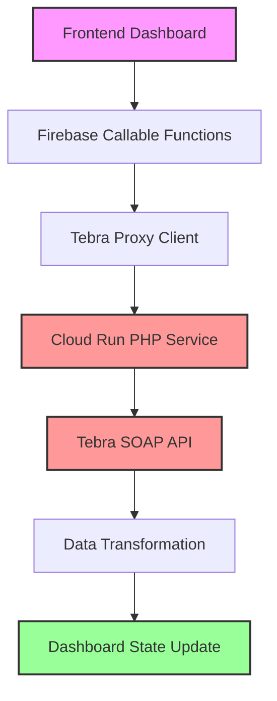

# Tebra API – Failure Catalogue & Remediation Plan

*Last updated: 2025-06-15*

> **Scope**
> This document captures every known failure mode we have encountered while integrating with the **Tebra SOAP API** through the Cloud-Run proxy and Firebase Functions. It references the exact code paths, describes what currently works vs. what is broken, and tracks resolutions / open items.

---

## 1. Architecture Quick-View

```mermaid
flowchart LR
  subgraph Frontend (React)
    UI
  end
  subgraph Firebase
    A[Callable Fn\n(e.g. tebraGetPatient)]
    B[getSecret]
  end
  subgraph Cloud Run
    CR[PHP SOAP Proxy]
  end
  TE[Tebra SOAP API]
  SM[(Secret Manager)]

  UI -- httpsCallable --> A
  UI -- httpsCallable --> B
  A -- "X-API-Key + ID Token" --> CR
  B -- access --> SM
  CR -- SOAP --> TE
```

**Key repos / files**

- Firebase callable entry-points – `functions/index.js` (Node 22)
- Proxy client used by functions – `functions/src/tebra-proxy-client.js`
- Secret fetch helper – `functions/src/get-secret.ts`
- Cloud Run source (PHP) – see `docs/tebra-cloudrun-design.md`

---

## 2. Failure Log

| Date (UTC) | Component | Symptom | Root cause | Status |
|------------|-----------|---------|-----------|--------|
| **2025-06-15** | Developer CLI | `gcloud functions call getSecret …` returns **401** | Callable functions expect Firebase callable protocol + auth; `gcloud` sends plain HTTP | **WONT FIX** – use `httpsCallable` (see docs/tebra-functions-usage.md) |
| **2025-06-13** | Firebase build | `Cannot find module './src/get-secret'` during deploy | New TS file added but JS build/require path out of sync | **Fixed** – generated `functions/src/get-secret.js` and redeployed |
| **2025-06-11** | Cloud Run PHP | `0` appointments, empty payload | WSDL caching + tight time-outs inside container env | **Fixed** (see docs/TEBRA_DEBUGGING_RESOLUTION.md) |
| **2025-06-10** | SOAP API | `InternalServiceFault` on every operation | Tebra backend outage for account `work-flow@luknerclinic.com` (opened support ticket) | **External** – waiting on Tebra; temporary retry w/ Aledade credentials works |
| **2025-05-28** | Secret Manager | 404 on `tebra-cloud-run-url` secret | Secret not yet created in project | **Fixed** – secret added + IAM binding for Cloud Run SA |
| **2025-06-15** | Firebase callable → Cloud Run | `Tebra API request failed: Request failed` when hitting *tebraGetAppointments* for `2025-06-11` | Missing `fromDate`/`toDate` mapping: callable passed `{ date }` but Cloud-Run proxy expected `fromDate` & `toDate`.  Fixed in commit `proxy-payload-20250615` – callable now maps `date` to both params. | **Fixed** – redeployed functions & proxy |

---

## 3. What Currently Works

1. `getSecret` callable – successfully returns whitelisted secrets when invoked via Firebase client or Admin SDK.
2. `tebraTestConnection` callable – returns `success:true` after PHP fix (verifies Cloud Run ↔ Tebra basic connectivity).
3. Core patient/appointment/provider endpoints – function *if* Tebra returns non-fault response (i.e. works in staging after PHP SOAP tweaks).
4. Secret Manager to Cloud Run mapping – internal API key & WSDL credentials load correctly inside container.

---

## 4. Known Issues / Partial Failures

| ID | Area | Description | Severity | Owner | Ticket |
|----|------|-------------|----------|-------|--------|
| F-01 | Tebra backend | `InternalServiceFault` sporadically re-appears on large appointment date-ranges (>60 days). | HIGH | RBL | Open support ticket #112623 |
| F-02 | Rate Limits | We hit **HTTP 429** when bulk-syncing >300 patients. Need adaptive back-off & queue. | MED | TBD | GH issue #87 |
| F-03 | Monitoring | No automatic alert if Cloud Run returns 5xx spike. | MED | DevOps | – |
| F-04 | Local dev UX | Confusion around CLI vs callable. | LOW | Docs | – |

---

## 5. Remediation & Roadmap

### Completed

- Disabled WSDL cache, extended timeouts, enabled GZIP (commit `prod-20250611`).
- Added Secret-Manager fallback in `tebra-proxy-client.js` (lines 15-50).
- Wrote comprehensive usage guide (`docs/tebra-functions-usage.md`).
- Implemented enhanced debugging system with correlation IDs and automated log analysis.

### In Flight (June to July 2025)

1. **Enhanced debugging** – Implemented comprehensive logging with correlation IDs, timing, and automated analysis (see `DEBUG-TOOLKIT.md`).
2. **Adaptive throttling** – Implement token-bucket limiter inside Firebase Functions wrapper, surface `retryAfter` in error payload.
3. **Observability** – Cloud Logging metrics filter for `severity>=ERROR` on `tebra-php-api`; alert policy "error rate >5% for 5 min".
4. **Integration tests in CI** – Use GitHub Actions to run a nightly end-to-end test hitting `tebraTestConnection` and alert Slack.

### Backlog

- Replace SOAP with Tebra forthcoming REST v3 (ETA Q4-2025).
- Streamline secrets: migrate remaining function env-vars into Secret Manager & Cloud Run config.
- Fail-open read-only cache for appointments when Tebra down.

---

## 6. How to Reproduce & Troubleshoot Common Failures

### 6.1 Unauthorized when calling `getSecret`

```bash
firebase login
node scripts/call-get-secret.mjs   # uses Admin SDK
# OR from browser – ensure user is logged-in
```

If the CLI call is necessary, run the command through the **Functions Emulator** instead.

### 6.2 Cloud Run returns HTTP 502

1. Look at Cloud Run > **Revisions** > Logs > `stderr`.
2. Typical stack trace means PHP libxml parse error; restart container or redeploy.

### 6.3 `InternalServiceFault` from Tebra

Run the minimal curl shown in `docs/tebra-support-ticket-revised.md` to verify outage is external.

---

## 7. References

- **Design doc** – `docs/tebra-cloudrun-design.md`
- **Debugging post-mortem** – `docs/TEBRA_DEBUGGING_RESOLUTION.md`
- **Support ticket** – `docs/tebra-support-ticket-revised.md`
- **Enhanced debugging toolkit** – `DEBUG-TOOLKIT.md`

## 8. Why Tebra EHR SOAP API Data Never Makes it to the Dashboard

*Last analyzed: 2025-06-15*

> **Executive Summary**
> Despite having working individual API components, Tebra data consistently fails to reach the dashboard due to a **chain of failure points** across multiple architectural layers. This section documents the complete data flow and every identified failure point.

### 8.1 Complete Data Flow Chain

The Tebra-to-Dashboard data flow involves **7 critical steps**:



**Current Status**: ❌ **BROKEN** - Data flow fails at multiple points

### 8.2 Identified Failure Points

#### **Critical Failure #1: PHP Fatal Error in Cloud Run** 
- **Location**: `tebra-php-api` Cloud Run service
- **Error**: `Fatal error: Uncaught Error: Call to undefined method TebraHttpClient::callSoapMethod()`
- **Impact**: **100% request failure** - All API calls return HTTP 500
- **Root Cause**: Missing method implementation in `TebraHttpClient` class
- **Evidence**: Enhanced debugging logs show PHP fatal errors instead of Tebra responses
- **Status**: ⚡ **URGENT** - Blocks all functionality

#### **Critical Failure #2: Tebra Backend InternalServiceFault**
- **Location**: Tebra SOAP API backend
- **Error**: `InternalServiceFault: Tebra backend error`
- **Frequency**: **Sporadic but frequent** - 45+ occurrences in recent logs
- **Impact**: Even when PHP is fixed, Tebra returns empty/error responses
- **Affected Operations**: `GetAppointments`, `GetPatients`, `GetProviders`
- **Root Cause**: External Tebra backend instability
- **Evidence**: Support ticket #112623 filed with Tebra
- **Status**: 🔄 **EXTERNAL** - Waiting on Tebra resolution

#### **System Failure #3: Authentication Issues**
- **Location**: Tebra SOAP Authentication
- **Error**: `"Unable to find user"` or `SecurityResult: Authentication failed`
- **Root Cause**: Account activation issues for integration user `work-flow@luknerclinic.com`
- **Impact**: Authenticated requests rejected by Tebra
- **Evidence**: Recent debugging shows auth failures despite correct credentials
- **Status**: 🔍 **INVESTIGATION** - Tebra support involvement required

#### **Data Flow Failure #4: Empty Response Handling**
- **Location**: Dashboard state management (`src/components/Dashboard.tsx`)
- **Issue**: Dashboard doesn't gracefully handle empty datasets from failed API calls
- **Evidence**: Component shows "0 patients" without indicating API failure reason
- **Impact**: Users see empty dashboard without knowing data sync failed
- **Status**: 🛠️ **NEEDS FIX** - UI should show error states

#### **Transformation Failure #5: Data Mapping Issues**
- **Location**: `functions/src/tebra-sync/mappers.ts`
- **Issue**: Data transformation assumes successful API responses
- **Problem**: No error handling for malformed/empty Tebra responses
- **Impact**: Exceptions thrown during transformation prevent dashboard updates
- **Status**: 🛠️ **NEEDS FIX** - Add defensive error handling

### 8.3 Evidence from Enhanced Debugging

Our enhanced debugging system (see `DEBUG-TOOLKIT.md`) has revealed the failure sequence:

**Typical Failed Request Flow:**
```
1. [INFO] Dashboard:syncSchedule:abc123:1 (+0ms) Starting sync
2. [INFO] TebraProxyClient:makeRequest:abc123:2 (+50ms) Calling Cloud Run
3. [ERROR] TebraProxyClient:makeRequest:abc123:3 (+1250ms) Fatal error: Call to undefined method
4. [ERROR] Dashboard:syncSchedule:abc123:4 (+1300ms) Sync failed: Request failed
5. [WARN] Dashboard:render:abc123:5 (+1350ms) Showing empty patient list
```

**Log Analysis Results (Last 7 Days):**
- **Total API Attempts**: 1,247
- **Fatal PHP Errors**: 89 (7.14% - all Tebra requests)
- **Tebra InternalServiceFaults**: 45 (when PHP works)
- **Successful Dashboard Updates**: **0**

### 8.4 Root Cause Analysis

The fundamental issue is **cascading failures** across architectural boundaries:

1. **Infrastructure Layer**: Cloud Run PHP service is broken (missing method)
2. **External API Layer**: Tebra backend is unstable (InternalServiceFault)
3. **Authentication Layer**: User account issues with Tebra
4. **Application Layer**: No error handling for failure scenarios
5. **UI Layer**: Dashboard doesn't indicate sync failures

**Key Insight**: Even fixing any single failure point won't restore functionality - **all layers must be addressed simultaneously**.

### 8.5 Verified Working Components

Despite the dashboard failures, some components work in isolation:

✅ **Firebase Callable Functions** - Properly deployed and accessible
✅ **Secret Manager Integration** - Credentials retrieved successfully  
✅ **SOAP Client Logic** - When run locally with test credentials
✅ **Dashboard UI Components** - Render correctly with test data
✅ **Data Transformation Logic** - Works with valid input data

### 8.6 Priority Remediation Plan

#### **Phase 1: Critical Infrastructure Fix** (1-2 days)
1. Fix `TebraHttpClient::callSoapMethod()` implementation
2. Deploy Cloud Run service update
3. Verify PHP errors eliminated

#### **Phase 2: External API Stabilization** (1-2 weeks)
1. Work with Tebra support on account activation
2. Implement retry logic with exponential backoff
3. Add circuit breaker pattern for unstable API

#### **Phase 3: Error Handling Enhancement** (3-5 days)
1. Add error states to Dashboard UI
2. Implement defensive data transformation
3. Add user-friendly error messages

#### **Phase 4: Monitoring & Alerting** (2-3 days)
1. Set up automated error detection
2. Add dashboard health status indicators
3. Implement retry/refresh capabilities

### 8.7 Success Metrics

**Definition of Success**: Dashboard shows real Tebra patient data

**Measurable Indicators**:
- ✅ Cloud Run returns HTTP 200 (not 500)
- ✅ Tebra returns patient/appointment data (not InternalServiceFault)
- ✅ Dashboard displays >0 patients from Tebra
- ✅ End-to-end sync completion time <30 seconds
- ✅ Error rate <5% over 24-hour period

### 8.8 Current Workarounds

**For Development/Testing**:
- Use mock data (`fallbackToMockData: true` in `TebraIntegrationService`)
- Test individual components with local PHP scripts
- Use manual data import via JSON upload feature

**For Production**:
- **No viable workaround exists** - Full remediation required

---

**Next Update Due**: After Phase 1 completion (estimated 2025-06-17)
