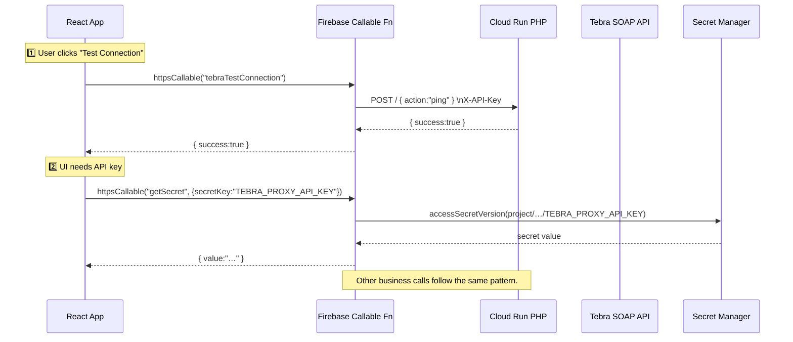

# Tebra Proxy & Cloud Run Functions – Usage & Testing Guide

This document explains **how to invoke the Firebase callable functions that front the Tebra Cloud Run service**, how to work with the `getSecret` helper, and how to test everything safely in each environment (local emulator, staging, production).

---

## 1&nbsp;&nbsp;Available Firebase callable functions

| Function name | Purpose | Region | Auth required | App Check enforced |
|---------------|---------|--------|---------------|-------------------|
| `getSecret` | Return a _whitelisted_ Secret-Manager value to the client. Prevents accidental leakage of high-privilege secrets. | `us-central1` | ✅ (must be logged-in) | ✅ (can be disabled during local dev) |
| `tebraTestConnection` | Ping the Cloud Run PHP service and return a simple success/fail payload. Useful as a smoke-test after deployments. | `us-central1` | ❌ (no PHI), but requests **should** come from privileged staff apps |   |
| `tebraGetPatient`, `tebraGetAppointments`, … | Main business APIs (see `functions/index.js`). | `us-central1` | ✅ | ✅ |

> ℹ️  All functions are declared with `onCall({ cors: true …})`, therefore **you must use `httpsCallable` (web / mobile) or the Admin SDK**. `gcloud functions call` & the legacy `firebase functions:call` CLI will _not_ work.

---

## 2&nbsp;&nbsp;Calling the functions from the web app

```ts
import { initializeApp } from 'firebase/app';
import { getFunctions, httpsCallable } from 'firebase/functions';
import { initializeAppCheck, ReCaptchaV3Provider } from 'firebase/app-check';

// ① Firebase init (env vars via Vite)
const app = initializeApp({
  apiKey: import.meta.env.VITE_FIREBASE_API_KEY,
  authDomain: import.meta.env.VITE_FIREBASE_AUTH_DOMAIN,
  projectId: import.meta.env.VITE_FIREBASE_PROJECT_ID,
  appId: import.meta.env.VITE_FIREBASE_APP_ID,
});

// ② OPTIONAL — App Check (prod only)
initializeAppCheck(app, {
  provider: new ReCaptchaV3Provider(import.meta.env.VITE_RECAPTCHA_KEY),
  isTokenAutoRefreshEnabled: true,
});

// ③ Functions instance (pin to the same region we deploy to)
const fns = getFunctions(app, 'us-central1');

export async function fetchSecret(secretKey: string) {
  const fn = httpsCallable(fns, 'getSecret');
  const res = await fn({ secretKey });
  return (res.data as any).value;
}

export async function testTebraConnection() {
  const fn = httpsCallable(fns, 'tebraTestConnection');
  const res = await fn();
  return res.data;
}
```

**Local testing**

```bash
firebase emulators:start --only auth,functions
```

The same code will automatically hit the local emulator when `FIREBASE_EMULATOR_HOST` env vars are set (the CLI injects them for you).

---

## 3&nbsp;&nbsp;Calling the functions from a server (Node.js) scrip

```js
import { initializeApp, cert } from 'firebase-admin/app';
import { getFunctions } from 'firebase-admin/functions';

initializeApp({ credential: cert('./service-account.json') });

async function main () {
  const fns = getFunctions(); // default region us-central1 is fine
  const getSecret = fns.httpsCallable('getSecret');
  const { data } = await getSecret({ secretKey: 'TEBRA_PROXY_API_KEY' });
  console.log('Secret:', data.value);
}

main().catch(console.error);
```

The Admin SDK authenticates as the service-account, so `req.auth` is present and App Check is bypassed (per Firebase docs).

---

## 4&nbsp;&nbsp;Common pitfalls & how to avoid them

| Symptom | Likely Cause | Fix |
|---------|--------------|-----|
| `functions:call` or `gcloud functions call` returns 400/401 | Those commands send a raw HTTP payload, **_not_** the callable-protocol JSON nor Firebase credentials. | Use `httpsCallable` or Admin SDK. |
| `HttpsError: unauthenticated` | Missing/expired Firebase Auth token. | Sign-in first or use Admin credentials. |
| `HttpsError: failed-precondition` (when App Check enabled) | App Check token missing or invalid. | Initialise App Check in the front-end or disable during dev. |
| 401 from Cloud Run | Incorrect `X-API-Key` env var or secret missing. | Verify `TEBRA_INTERNAL_API_KEY` in Secret Manager and Cloud Run env. |

---

## 5&nbsp;&nbsp;Updating the whitelist for `getSecret`

1. Edit `functions/src/get-secret.ts` and add the secret name to the `ALLOWED` set.
2. Ensure the secret exists in Secret Manager (`gcloud secrets versions add …`).
3. Deploy: `firebase deploy --only functions:getSecret`.

---

## 6&nbsp;&nbsp;Sequence diagram (high-level)



---

## 7&nbsp;&nbsp;Further reading

- `docs/tebra-cloudrun-design.md` – complete infrastructure & security design
- `docs/MONITORING_SETUP.md` – how to wire logs and alerts into Cloud Logging & Slack
- Firebase docs — Callable functions: <https://firebase.google.com/docs/functions/callable>
- App Check overview: <https://firebase.google.com/docs/app-check>
