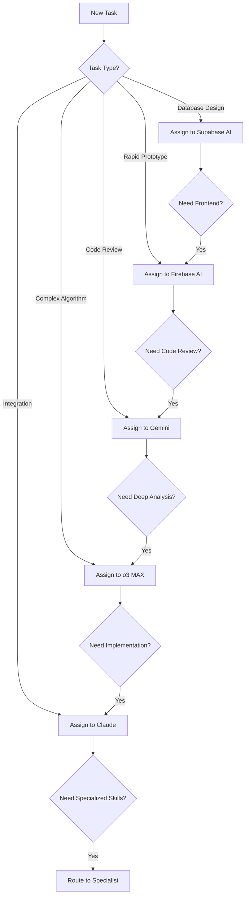

# AI Capabilities Matrix & Agent Coordination System

## 🤖 AI Agent Strengths & Specializations

### **Comprehensive Capabilities Matrix**

| Capability | Claude | o3 MAX | Gemini | Firebase AI | Supabase AI | Human |
|------------|--------|---------|---------|-------------|-------------|-------|
| **🧠 Deep Reasoning** | ⭐⭐⭐ | ⭐⭐⭐⭐⭐ | ⭐⭐⭐⭐ | ⭐⭐ | ⭐⭐ | ⭐⭐⭐⭐ |
| **💻 Code Generation** | ⭐⭐⭐⭐ | ⭐⭐⭐⭐ | ⭐⭐⭐⭐⭐ | ⭐⭐⭐⭐ | ⭐⭐⭐ | ⭐⭐⭐⭐⭐ |
| **🔧 System Integration** | ⭐⭐⭐⭐⭐ | ⭐⭐⭐ | ⭐⭐⭐⭐ | ⭐⭐⭐⭐ | ⭐⭐⭐⭐ | ⭐⭐⭐⭐⭐ |
| **📊 Data Analysis** | ⭐⭐⭐ | ⭐⭐⭐⭐⭐ | ⭐⭐⭐⭐ | ⭐⭐⭐ | ⭐⭐⭐⭐ | ⭐⭐⭐⭐ |
| **🔒 Security Analysis** | ⭐⭐⭐⭐ | ⭐⭐⭐⭐⭐ | ⭐⭐⭐⭐ | ⭐⭐⭐ | ⭐⭐⭐⭐ | ⭐⭐⭐⭐⭐ |
| **🎨 UI/UX Design** | ⭐⭐⭐ | ⭐⭐ | ⭐⭐⭐⭐ | ⭐⭐⭐⭐ | ⭐⭐ | ⭐⭐⭐⭐⭐ |
| **🌐 Real-time Info** | ⭐⭐ | ⭐⭐ | ⭐⭐⭐⭐⭐ | ⭐⭐⭐ | ⭐⭐⭐ | ⭐⭐⭐⭐⭐ |
| **📱 Multimodal** | ⭐⭐⭐⭐ | ⭐⭐⭐ | ⭐⭐⭐⭐⭐ | ⭐⭐⭐ | ⭐⭐ | ⭐⭐⭐⭐⭐ |
| **🚀 Rapid Prototyping** | ⭐⭐⭐⭐ | ⭐⭐⭐ | ⭐⭐⭐⭐ | ⭐⭐⭐⭐⭐ | ⭐⭐⭐⭐ | ⭐⭐⭐ |
| **🧪 Testing & QA** | ⭐⭐⭐⭐⭐ | ⭐⭐⭐⭐ | ⭐⭐⭐⭐ | ⭐⭐⭐ | ⭐⭐⭐ | ⭐⭐⭐⭐⭐ |
| **📚 Documentation** | ⭐⭐⭐⭐⭐ | ⭐⭐⭐ | ⭐⭐⭐⭐ | ⭐⭐⭐ | ⭐⭐⭐ | ⭐⭐⭐⭐ |
| **🔄 Project Management** | ⭐⭐⭐⭐⭐ | ⭐⭐⭐ | ⭐⭐⭐ | ⭐⭐ | ⭐⭐ | ⭐⭐⭐⭐⭐ |
| **💾 Database Design** | ⭐⭐⭐⭐ | ⭐⭐⭐⭐ | ⭐⭐⭐⭐ | ⭐⭐⭐⭐ | ⭐⭐⭐⭐⭐ | ⭐⭐⭐⭐⭐ |
| **☁️ Cloud Architecture** | ⭐⭐⭐⭐ | ⭐⭐⭐⭐ | ⭐⭐⭐⭐ | ⭐⭐⭐⭐⭐ | ⭐⭐⭐⭐ | ⭐⭐⭐⭐⭐ |
| **🧮 Mathematical Analysis** | ⭐⭐⭐ | ⭐⭐⭐⭐⭐ | ⭐⭐⭐⭐ | ⭐⭐ | ⭐⭐⭐ | ⭐⭐⭐⭐ |

## 🎯 Specialized Agent Assignments

### **Claude - Integration & Coordination Specialist**

```yaml
Primary Strengths:
  - System integration and file management
  - Project coordination and task management
  - Testing and quality assurance
  - Documentation and communication
  - Cross-platform workflow orchestration

Ideal Tasks:
  - Coordinating multi-AI collaborations
  - Integrating solutions from other AIs
  - Managing GitHub repositories and issues
  - Writing comprehensive documentation
  - Testing and validating implementations
  - Deploying and monitoring systems

Handoff Scenarios:
  - "Need complex algorithm → @o3-max"
  - "Need real-time data → @gemini"
  - "Need rapid prototyping → @firebase-ai @bolt-new"
  - "Need database optimization → @supabase-ai"
```

### **o3 MAX - Deep Analysis & Complex Problem Solving**

```yaml
Primary Strengths:
  - Complex mathematical analysis
  - Deep logical reasoning and problem solving
  - Security vulnerability analysis
  - Algorithm design and optimization
  - Strategic planning and architecture

Ideal Tasks:
  - Designing complex authentication algorithms
  - Security threat modeling and analysis
  - Performance optimization strategies
  - Complex data structure design
  - Strategic technical decision making

Handoff Scenarios:
  - "Need implementation → @claude"
  - "Need UI/UX design → @gemini @firebase-ai"
  - "Need real-time features → @gemini @supabase-ai"
  - "Need rapid testing → @claude @lovable-dev"
```

### **Gemini - Code Excellence & Multimodal Analysis**

```yaml
Primary Strengths:
  - Code review and optimization
  - Real-time information access
  - Multimodal content analysis
  - UI/UX design and validation
  - Technical documentation

Ideal Tasks:
  - Code quality reviews and refactoring
  - Real-time API integration
  - Image and document analysis
  - User interface design
  - Performance benchmarking

Handoff Scenarios:
  - "Need deep security analysis → @o3-max"
  - "Need system integration → @claude"
  - "Need database design → @supabase-ai"
  - "Need rapid deployment → @firebase-ai"
```

### **Firebase AI - Rapid App Development**

```yaml
Primary Strengths:
  - Rapid application scaffolding
  - Cloud function generation
  - Mobile and web app development
  - Real-time backend services
  - Authentication and security rules

Ideal Tasks:
  - Creating full-stack applications quickly
  - Generating Firebase Functions
  - Setting up authentication flows
  - Implementing real-time features
  - Mobile app development

Handoff Scenarios:
  - "Need complex algorithms → @o3-max"
  - "Need code review → @gemini"
  - "Need integration testing → @claude"
  - "Need database optimization → @supabase-ai"
```

### **Supabase AI - Database & Open Source Backend**

```yaml
Primary Strengths:
  - SQL query generation and optimization
  - Database schema design
  - Row Level Security (RLS) policies
  - Real-time subscription optimization
  - Open-source backend architecture

Ideal Tasks:
  - Designing database schemas
  - Writing complex SQL queries
  - Creating security policies
  - Optimizing database performance
  - Real-time data synchronization

Handoff Scenarios:
  - "Need frontend development → @firebase-ai @gemini"
  - "Need security analysis → @o3-max"
  - "Need system integration → @claude"
  - "Need rapid prototyping → @bolt-new @lovable-dev"
```

## 🔄 Agent Coordination Protocols

### **Task Assignment Decision Tree**



### **Collaboration Patterns**

#### **1. Sequential Handoff Pattern**

```yaml
Pattern: A → B → C → Done
Example: Security Analysis
  Step 1: o3 MAX analyzes security requirements
  Step 2: Gemini reviews implementation approach
  Step 3: Claude integrates and tests solution
```

#### **2. Parallel Collaboration Pattern**

```yaml
Pattern: A + B + C → Synthesis → Done
Example: Full-Stack Development
  Parallel: 
    - o3 MAX: Algorithm design
    - Gemini: UI/UX design
    - Supabase AI: Database schema
  Synthesis: Claude integrates all components
```

#### **3. Specialist Consultation Pattern**

```yaml
Pattern: Primary Agent ↔ Specialist → Continue
Example: Claude developing with o3 MAX consultation
  Primary: Claude handles main development
  Consultation: o3 MAX provides complex algorithm advice
  Result: Claude continues with enhanced solution
```

### **Agent Communication Protocols**

#### **GitHub Issue Agent Mentions**

```markdown
## Standard Agent Mention Format

### Request Complex Analysis
@o3-max I need deep analysis of [specific problem]
Context: [current situation]
Required: [expected deliverable]
Deadline: [timeline]

### Request Code Review
@gemini Please review [code/architecture]
Focus: [performance/security/optimization]
Files: [specific files or components]

### Request Integration
@claude Please integrate the following solutions:
- o3 MAX solution: [description]
- Gemini feedback: [description]
- Expected outcome: [description]

### Request Rapid Prototype
@firebase-ai Create prototype for [feature]
Requirements: [key features]
Integration: [existing systems]

### Request Database Design
@supabase-ai Design database for [use case]
Entities: [main data objects]
Relationships: [how they connect]
Performance: [expected load]
```

#### **Automated Agent Routing**

```yaml
# GitHub Action for automatic agent assignment
name: AI Agent Router

on:
  issue_comment:
    types: [created]

jobs:
  route-to-agent:
    runs-on: ubuntu-latest
    steps:
      - name: Analyze request and assign to appropriate AI
        uses: actions/github-script@v6
        with:
          script: |
            const comment = context.payload.comment.body.toLowerCase();
            const labels = [];
            
            // Route based on keywords
            if (comment.includes('complex') || comment.includes('algorithm') || comment.includes('security analysis')) {
              labels.push('ai/o3-max');
            }
            if (comment.includes('code review') || comment.includes('optimization') || comment.includes('real-time')) {
              labels.push('ai/gemini');
            }
            if (comment.includes('integration') || comment.includes('testing') || comment.includes('deployment')) {
              labels.push('ai/claude');
            }
            if (comment.includes('prototype') || comment.includes('firebase') || comment.includes('app development')) {
              labels.push('ai/firebase');
            }
            if (comment.includes('database') || comment.includes('sql') || comment.includes('supabase')) {
              labels.push('ai/supabase');
            }
            
            // Apply labels
            if (labels.length > 0) {
              await github.rest.issues.addLabels({
                owner: context.repo.owner,
                repo: context.repo.repo,
                issue_number: context.payload.issue.number,
                labels: labels
              });
            }
```

## 📊 Capability-Based Task Routing

### **Task Complexity Matrix**

| Task Type | Complexity | Recommended Agent(s) | Collaboration Pattern |
|-----------|------------|---------------------|----------------------|
| **Algorithm Design** | High | o3 MAX → Claude | Sequential |
| **Code Review** | Medium | Gemini + Claude | Parallel |
| **UI/UX Design** | Medium | Gemini + Firebase AI | Parallel |
| **Database Schema** | High | Supabase AI → o3 MAX → Claude | Sequential |
| **Security Analysis** | High | o3 MAX + Gemini → Claude | Parallel → Sequential |
| **Rapid Prototype** | Low | Firebase AI OR Bolt.new | Single |
| **Integration Testing** | Medium | Claude + Gemini | Parallel |
| **Performance Optimization** | High | o3 MAX + Gemini → Claude | Parallel → Sequential |
| **Documentation** | Low | Claude | Single |
| **Project Management** | Medium | Claude + Human | Collaborative |

### **Smart Agent Selection Algorithm**

```python
def select_optimal_agents(task_description, requirements, complexity):
    """
    Automatically select the best AI agents for a given task
    """
    capabilities_matrix = {
        'claude': {
            'integration': 5, 'testing': 5, 'documentation': 5,
            'project_management': 5, 'coordination': 5
        },
        'o3_max': {
            'deep_reasoning': 5, 'security': 5, 'algorithms': 5,
            'mathematical_analysis': 5, 'complex_problem_solving': 5
        },
        'gemini': {
            'code_review': 5, 'real_time': 5, 'multimodal': 5,
            'ui_design': 4, 'performance': 4
        },
        'firebase_ai': {
            'rapid_prototyping': 5, 'cloud_functions': 5,
            'mobile_dev': 4, 'app_scaffolding': 5
        },
        'supabase_ai': {
            'database_design': 5, 'sql_optimization': 5,
            'rls_policies': 5, 'real_time_db': 4
        }
    }
    
    # Score each agent based on task requirements
    scores = {}
    for agent, capabilities in capabilities_matrix.items():
        score = sum(capabilities.get(req, 0) for req in requirements)
        scores[agent] = score
    
    # Select top agents based on complexity
    if complexity == 'high':
        return sorted(scores.items(), key=lambda x: x[1], reverse=True)[:3]
    elif complexity == 'medium':
        return sorted(scores.items(), key=lambda x: x[1], reverse=True)[:2]
    else:
        return [max(scores.items(), key=lambda x: x[1])]
```

## 🚀 Implementation Examples

### **Example 1: Redis 2FA Dashboard Development**

```markdown
## Task: Comprehensive Redis 2FA Management Dashboard

### Automatic Agent Assignment:
1. **o3 MAX**: Security architecture and threat modeling
2. **Gemini**: UI/UX design and code review
3. **Firebase AI**: Rapid prototype development
4. **Supabase AI**: User data tracking and analytics
5. **Claude**: Integration, testing, and deployment

### Workflow:
```

Phase 1 (Parallel):
├── o3 MAX: Design security model
├── Gemini: Create UI mockups
├── Firebase AI: Build initial prototype
└── Supabase AI: Design user tracking schema

Phase 2 (Integration):
└── Claude: Integrate all components and test

Phase 3 (Validation):
├── Gemini: Performance review
├── o3 MAX: Security validation
└── Claude: Final deployment

```
```

### **Example 2: AI Agent Coordination System**

```markdown
## Task: Build the capabilities matrix system itself

### Recursive Agent Assignment:
1. **o3 MAX**: Design the agent selection algorithm
2. **Gemini**: Implement the GitHub automation
3. **Supabase AI**: Create agent performance tracking
4. **Claude**: Coordinate development and testing

### Meta-Learning Loop:
- Track which agent combinations work best
- Optimize future assignments based on success rates
- Continuously improve the capabilities matrix
```

## 📈 Success Metrics & Optimization

### **Agent Performance Tracking**

```sql
-- Supabase AI generated tracking schema
CREATE TABLE agent_tasks (
  id UUID PRIMARY KEY DEFAULT gen_random_uuid(),
  task_id TEXT NOT NULL,
  agent_name TEXT NOT NULL,
  task_type TEXT NOT NULL,
  complexity TEXT CHECK (complexity IN ('low', 'medium', 'high')),
  start_time TIMESTAMP WITH TIME ZONE DEFAULT now(),
  completion_time TIMESTAMP WITH TIME ZONE,
  success_rating INTEGER CHECK (success_rating BETWEEN 1 AND 5),
  collaboration_pattern TEXT,
  handoff_count INTEGER DEFAULT 0
);

CREATE TABLE agent_capabilities_feedback (
  id UUID PRIMARY KEY DEFAULT gen_random_uuid(),
  agent_name TEXT NOT NULL,
  capability TEXT NOT NULL,
  task_id TEXT NOT NULL,
  performance_score INTEGER CHECK (performance_score BETWEEN 1 AND 5),
  feedback_notes TEXT,
  created_at TIMESTAMP WITH TIME ZONE DEFAULT now()
);
```

### **Continuous Improvement Process**

```yaml
Weekly Review Process:
  1. Analyze agent performance metrics
  2. Identify successful collaboration patterns
  3. Update capabilities matrix based on results
  4. Optimize task routing algorithms
  5. Share learnings across all agents

Optimization Targets:
  - Reduce task completion time
  - Improve solution quality
  - Minimize handoff friction
  - Maximize agent specialization benefits
```

---

**Ready to orchestrate AI collaboration like a symphony! 🎼🤖**
