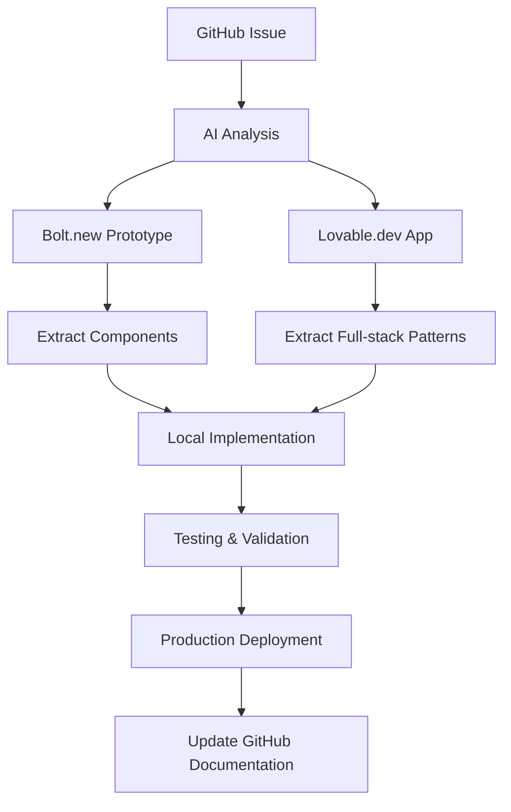

# Multi-Platform Development & AI Collaboration Workflow

## 🚀 Complete Ecosystem Overview

### **Platform Specializations**

| Platform | Best For | AI Integration | Speed | Persistence | GitHub Required |
|----------|----------|----------------|--------|-------------|----------------|
| **GitHub** | Project management, code tracking, CI/CD | ⭐⭐⭐ | Medium | Permanent | Native |
| **Bolt.new** | Rapid React/Node prototyping from GitHub | ⭐⭐⭐⭐⭐ | Instant | GitHub Repo | Yes |
| **Lovable.dev** | Full-stack app prototyping from GitHub | ⭐⭐⭐⭐ | Fast | GitHub Repo | Yes |
| **Firebase** | Backend services + AI app development | ⭐⭐⭐⭐⭐ | Fast | Commercial | Optional |
| **Supabase** | Open-source backend + AI development | ⭐⭐⭐⭐⭐ | Fast | Commercial | Optional |
| **Local Development** | Production implementation | ⭐⭐⭐⭐⭐ | Medium | Permanent | Git Push |

## 🎯 Unified Workflow Strategy

### **Phase 1: GitHub-Centric Workflow**

```
💡 Idea → 📋 GitHub Issue → 🤖 AI Analysis → ⚡ GitHub → Bolt.new/Lovable → 🔥 Firebase/Supabase AI → 🏗️ Production
```

### **Phase 2: AI-Powered Development Pipeline**

```
GitHub Repository ←→ Bolt.new (from GitHub) ←→ Lovable.dev (from GitHub) ←→ Firebase AI ←→ Supabase AI ←→ Production
```

## 🔧 Platform-Specific Setups

### 1. **GitHub Repository Setup (Required for All Platforms)**

#### **Prerequisites:**

- GitHub repository with proper structure
- Issues enabled for project management
- Actions enabled for automation
- Repository must be public or have proper access tokens

#### **Repository Structure:**

```
workflow-bolt/
├── .github/
│   ├── ISSUE_TEMPLATE/
│   └── workflows/
├── prototypes/
│   ├── bolt-new/
│   ├── lovable/
│   ├── firebase/
│   └── supabase/
├── scripts/
└── docs/
```

### 2. **Bolt.new Integration (GitHub Required)**

#### **Purpose:**

- ⚡ **Instant React prototyping** directly from GitHub repos
- 🎨 **UI/UX experimentation** with immediate deployment
- 🧪 **Proof of concept development** with GitHub sync
- 📱 **Component library testing** with version control

#### **Workflow:**

```
1. Create GitHub Issue with prototype request
2. Push basic structure to GitHub repo
3. Open Bolt.new with GitHub repo URL: https://bolt.new/github.com/user/repo
4. Bolt.new clones and allows instant editing
5. Changes sync back to GitHub automatically
6. Share live preview URL in GitHub Issue
```

#### **GitHub Integration Requirements:**

- Repository must be accessible to Bolt.new
- Proper package.json with dependencies
- Basic React/Node.js structure

#### **Best Practices:**

- **Document experiments** - Save Bolt.new URLs in GitHub Issues
- **Extract reusable components** - Copy successful code to local repo
- **Test interactions** - Use for complex UI state management
- **Mobile responsiveness** - Quick mobile testing

#### **Example Redis 2FA Dashboard Prototype:**

```markdown
## GitHub Issue: [Prototype] Redis 2FA Management Dashboard

### Bolt.new Experiments:
1. **User Management Interface**: https://bolt.new/sb1-xyz123
   - CRUD operations for Redis users
   - TOTP QR code display
   - Secret rotation controls

2. **Authentication Flow**: https://bolt.new/sb1-abc456
   - Login with TOTP + Custom 2FA
   - Error handling and validation
   - Success/failure states

3. **Monitoring Dashboard**: https://bolt.new/sb1-def789
   - Real-time Redis connection status
   - User activity logs
   - Security alerts
```

### 3. **Lovable.dev Integration (GitHub Required)**

#### **Purpose:**

- 🏗️ **Full-stack application prototyping** from GitHub repos
- 🔗 **API integration testing** with GitHub sync
- 🎨 **Complete user journey validation** with version control
- 📊 **Data visualization prototypes** with deployment

#### **Workflow:**

```
1. Create branch in GitHub repo for Lovable experiment
2. Open Lovable.dev with GitHub repo URL
3. Lovable.dev provides full-stack editing environment
4. Test with real APIs (Redis, Google Cloud, Firebase, Supabase)
5. Changes sync back to GitHub branch
6. Merge successful patterns into main branch
```

#### **GitHub Integration Requirements:**

- Repository with full-stack structure (frontend + backend)
- Proper environment configuration
- API keys and configuration files
- Database schemas and migrations

### 4. **Firebase AI Development**

#### **Purpose:**

- 🤖 **AI-powered app generation** with Firebase services
- 🔥 **Instant backend deployment** with Firebase Functions
- 📱 **Mobile and web app development** with Firebase SDK
- 🧠 **AI assistance for Firebase configuration**

#### **Firebase AI Features:**

```
Firebase Extensions + AI:
- AI-powered content generation
- Intelligent data processing
- Automated cloud function creation
- Smart security rules generation
```

#### **Workflow:**

```
1. Create Firebase project linked to GitHub repo
2. Use Firebase AI tools for app generation
3. AI generates Firebase Functions, Firestore rules, hosting config
4. Deploy directly from GitHub with Firebase CLI
5. Integrate with existing Redis 2FA system
```

#### **Example Firebase AI Integration:**

```javascript
// AI-generated Firebase Function for Redis user management
exports.createRedisUser = functions.https.onCall(async (data, context) => {
  // AI-generated authentication and validation
  const { username, userType } = data;
  
  // AI-generated Redis integration
  const redisClient = await connectToRedis();
  const userManager = new RedisUserManager();
  
  // AI-generated TOTP and security logic
  const result = await userManager.create(username, userType);
  
  return result;
});
```

### 5. **Supabase AI Development**

#### **Purpose:**

- 🐘 **Open-source backend with AI assistance**
- 🤖 **AI-powered SQL query generation**
- 🔗 **Real-time features with AI optimization**
- 🛡️ **AI-assisted Row Level Security (RLS) policies**

#### **Supabase AI Features:**

```
Supabase AI Capabilities:
- SQL query generation from natural language
- Database schema design assistance
- Real-time subscription optimization
- Security policy generation
- API endpoint creation
```

#### **Workflow:**

```
1. Create Supabase project with GitHub integration
2. Use Supabase AI to design database schema
3. AI generates SQL tables, functions, and policies
4. Connect to GitHub for automatic deployments
5. Integrate with Redis 2FA for hybrid architecture
```

#### **Example Supabase AI Integration:**

```sql
-- AI-generated table for Redis user tracking
CREATE TABLE redis_users (
  id UUID DEFAULT gen_random_uuid() PRIMARY KEY,
  username TEXT UNIQUE NOT NULL,
  user_type TEXT CHECK (user_type IN ('agent', 'human')),
  created_at TIMESTAMP WITH TIME ZONE DEFAULT now(),
  last_login TIMESTAMP WITH TIME ZONE,
  totp_secret_rotated_at TIMESTAMP WITH TIME ZONE,
  is_active BOOLEAN DEFAULT true
);

-- AI-generated RLS policy
CREATE POLICY "Users can view their own data" ON redis_users
  FOR SELECT USING (auth.uid()::text = user_metadata->>'redis_username');

-- AI-generated function for user management
CREATE OR REPLACE FUNCTION manage_redis_user(
  p_username TEXT,
  p_action TEXT
) RETURNS JSON AS $$
-- AI-generated Redis integration logic
BEGIN
  -- Call Redis user management functions
  -- Return structured response
END;
$$ LANGUAGE plpgsql SECURITY DEFINER;
```

#### **Best Practices:**

- **API mocking** - Test with realistic data structures
- **Error handling** - Prototype complete error scenarios
- **Performance testing** - Validate under load
- **Security testing** - Test authentication flows

#### **Example Redis 2FA Complete App:**

```markdown
## Lovable.dev Prototypes:

### 1. Redis User Management System
**URL**: https://lovable.dev/projects/redis-user-mgmt
**Features**:
- Complete CRUD for Redis users
- TOTP setup with QR codes
- Secret rotation scheduling
- Audit logs and monitoring
- Integration with Google Secret Manager

### 2. Multi-AI Task Orchestration
**URL**: https://lovable.dev/projects/ai-orchestration
**Features**:
- Task assignment to different AIs
- Progress tracking and status updates
- Result aggregation and comparison
- Performance analytics
```

### 3. **GitHub Issues as Central Hub**

#### **Enhanced Issue Templates for Multi-Platform**

##### **Prototype Request Template**

```yaml
name: Prototype Request
about: Request for rapid prototyping
title: '[Prototype] '
labels: ['type/prototype', 'platform/bolt', 'platform/lovable']

body:
  - type: dropdown
    id: platform
    attributes:
      label: Prototyping Platform
      options:
        - Bolt.new (React components, UI/UX)
        - Lovable.dev (Full-stack applications)
        - Both (Compare approaches)

  - type: textarea
    id: concept
    attributes:
      label: Concept Description
      description: What needs to be prototyped?
      placeholder: Redis user management dashboard with TOTP setup flow

  - type: textarea
    id: requirements
    attributes:
      label: Key Requirements
      description: Essential features and constraints
      placeholder: |
        - User authentication with TOTP
        - QR code generation
        - Real-time status updates
        - Mobile responsive design

  - type: checkboxes
    id: ai-assistance
    attributes:
      label: AI Assistance Needed
      options:
        - label: o3 MAX - Complex logic and algorithms
        - label: Gemini - Code review and optimization
        - label: Claude - Integration and testing

  - type: input
    id: timeline
    attributes:
      label: Timeline
      description: When do you need this prototype?
      placeholder: "ASAP for demo" or "1 week for thorough testing"
```

##### **Cross-Platform Implementation Template**

```yaml
name: Cross-Platform Implementation
about: Implement across multiple platforms
title: '[Multi-Platform] '
labels: ['type/feature', 'platform/github', 'platform/bolt', 'platform/lovable', 'platform/local']

body:
  - type: textarea
    id: implementation-plan
    attributes:
      label: Implementation Plan
      description: How will this be implemented across platforms?
      value: |
        ## Phase 1: Prototyping
        - [ ] Bolt.new: UI/UX exploration
        - [ ] Lovable.dev: Full-stack validation
        
        ## Phase 2: Production
        - [ ] Local implementation
        - [ ] Integration testing
        - [ ] Deployment to production
        
        ## Phase 3: Documentation
        - [ ] Update GitHub documentation
        - [ ] Create usage examples
        - [ ] Performance benchmarks

  - type: textarea
    id: prototype-links
    attributes:
      label: Prototype Links
      description: Links to prototypes and experiments
      placeholder: |
        - Bolt.new experiment: https://bolt.new/sb1-xyz
        - Lovable.dev app: https://lovable.dev/projects/abc
        - Local branch: feature/new-implementation
```

## 🤖 AI Collaboration Workflows

> **📋 See `ai-capabilities-matrix.md` for detailed agent specializations and coordination protocols**

### **Intelligent Agent Assignment**

#### **Capabilities-Based Routing:**

```yaml
Complex Problems → o3 MAX (deep reasoning, security analysis)
Code Review → Gemini (optimization, real-time features)
Integration → Claude (testing, deployment, coordination)
Rapid Prototyping → Firebase AI (app generation, cloud functions)
Database Design → Supabase AI (SQL optimization, RLS policies)
```

### **Multi-AI Collaboration Patterns**

#### **Sequential Handoff:**

```
o3 MAX (Algorithm) → Gemini (Implementation) → Claude (Integration) → Production
```

#### **Parallel Collaboration:**

```
┌── o3 MAX: Security model
├── Gemini: UI/UX design  
├── Firebase AI: Backend prototype
├── Supabase AI: Database schema
└── Claude: Integration & testing
```

#### **Specialist Consultation:**

```
Claude (Primary) ↔ o3 MAX (Complex Analysis) → Enhanced Solution
Claude (Primary) ↔ Gemini (Performance Review) → Optimized Solution
```

### **Multi-AI Collaboration Example:**

#### **Task: Redis 2FA Dashboard with Real-time Monitoring**

##### **GitHub Issue: [Multi-AI] Redis Dashboard Development**

```markdown
## AI Assignments
- **o3 MAX**: Design real-time data processing algorithms
- **Gemini**: Code review and security analysis  
- **Claude**: Platform integration and deployment

## Platform Workflow
1. **Bolt.new**: o3 MAX designs UI components
2. **Lovable.dev**: Gemini builds full-stack version
3. **Local**: Claude integrates with production systems
4. **GitHub**: All document progress and results

## Deliverables
- [ ] Bolt.new prototype with core UI
- [ ] Lovable.dev app with real-time features
- [ ] Local implementation with production APIs
- [ ] Security review and performance benchmarks
```

## 🔄 Platform Synchronization

### **Code Flow Management**



### **Automated Synchronization**

#### **GitHub Actions for Platform Integration**

```yaml
name: Multi-Platform Sync

on:
  issue_comment:
    types: [created]

jobs:
  extract-prototypes:
    if: contains(github.event.comment.body, '/extract-prototype')
    runs-on: ubuntu-latest
    steps:
      - name: Create implementation branch
        run: |
          # Extract Bolt.new/Lovable URLs from issue
          # Create new branch for implementation
          # Add TODO checklist for manual extraction
```

### **Documentation Standards**

#### **Prototype Documentation Template**

```markdown
## Prototype: [Name]
**Platform**: Bolt.new / Lovable.dev
**URL**: [Live Link]
**Status**: Experiment / Validated / Ready for Production

### Features Tested
- [ ] Feature 1: Description and results
- [ ] Feature 2: Description and results
- [ ] Feature 3: Description and results

### Key Learnings
- **What worked**: Successful patterns and approaches
- **What didn't**: Failed experiments and lessons learned
- **Performance**: Speed, responsiveness, user experience

### Next Steps
- [ ] Extract reusable components
- [ ] Implement in local development
- [ ] Add to production roadmap
```

## 📊 Success Metrics

### **Platform-Specific KPIs**

| Platform | Success Metrics |
|----------|----------------|
| **Bolt.new** | Prototypes per week, successful pattern extraction |
| **Lovable.dev** | Complete apps built, API integration success |
| **GitHub Issues** | Issue resolution time, cross-platform coordination |
| **Local Development** | Production deployments, code quality metrics |

### **Overall Collaboration Metrics**

- **Idea to Prototype**: Time from GitHub Issue to working prototype
- **Prototype to Production**: Time from validated prototype to deployment
- **AI Efficiency**: Quality and speed of AI contributions
- **Cross-Platform Value**: Reuse of patterns across platforms

## 🚀 Quick Start Guide

### **1. Set Up GitHub Project**

```bash
# Create repository and enable Issues
gh repo create multi-ai-development --public
gh issue create --title "[Setup] Initialize Multi-Platform Workflow"
```

### **2. Create First Prototype**

```bash
# Document in GitHub Issue
gh issue create --title "[Prototype] Redis 2FA Dashboard" --body-file prototype-template.md

# Start prototyping
open https://bolt.new
open https://lovable.dev
```

### **3. AI Collaboration**

```markdown
## In GitHub Issue Comments:
@o3-max Please design the authentication flow algorithm
@gemini Please review the security implications
@claude Please coordinate the implementation
```

### **4. Extract and Implement**

```bash
# Create implementation branch
git checkout -b feature/redis-dashboard

# Extract patterns from prototypes
# Implement in local development
# Test and deploy
```

## 🎯 Platform-Specific Best Practices

### **Bolt.new**

- ✅ **Fast iterations** - Try multiple approaches quickly
- ✅ **Component focus** - Build reusable UI components
- ✅ **State management** - Test complex interactions
- ❌ **Avoid** - Heavy backend logic, complex data flows

### **Lovable.dev**

- ✅ **Full workflows** - Test complete user journeys
- ✅ **API integration** - Validate with real services
- ✅ **Performance** - Test under realistic conditions
- ❌ **Avoid** - Production deployments, sensitive data

### **GitHub Issues**

- ✅ **Central coordination** - All decisions documented
- ✅ **Cross-references** - Link prototypes to implementations
- ✅ **Progress tracking** - Clear status updates
- ❌ **Avoid** - Detailed technical discussions (use comments)

### **Local Development**

- ✅ **Production ready** - Security, performance, testing
- ✅ **Integration** - Real APIs, databases, services
- ✅ **Documentation** - Comprehensive guides and examples
- ❌ **Avoid** - Experimental features without prototype validation

## 🏆 Success Stories Template

### **Example: Redis 2FA Dashboard**

```markdown
## Success Story: Redis 2FA Management Dashboard

### Timeline: 3 days total
- **Day 1**: GitHub Issue creation + AI analysis (2 hours)
- **Day 1**: Bolt.new UI prototyping (4 hours)
- **Day 2**: Lovable.dev full-stack app (6 hours)
- **Day 3**: Local implementation + testing (8 hours)

### Results:
- ✅ **Validated concept** in 24 hours
- ✅ **Working prototype** with real APIs
- ✅ **Production deployment** with full testing
- ✅ **Reusable components** for future projects

### Key Benefits:
- **80% faster** than traditional development
- **Higher quality** through rapid iteration
- **Better UX** from prototype user testing
- **AI collaboration** provided multiple perspectives
```

---

**Ready to revolutionize development with multi-platform AI collaboration! 🚀**
