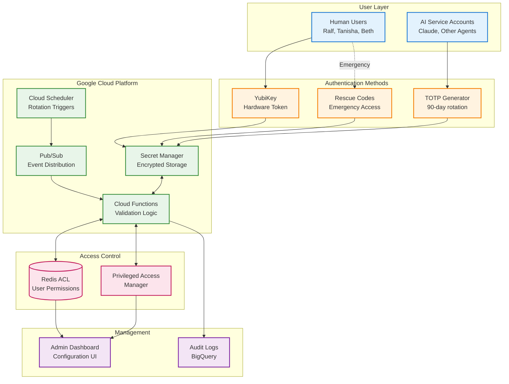
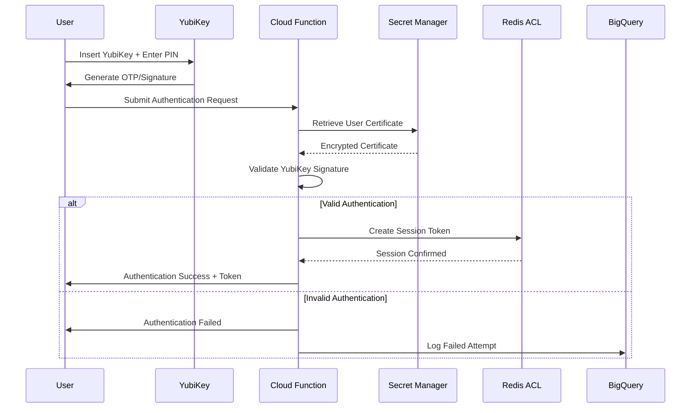
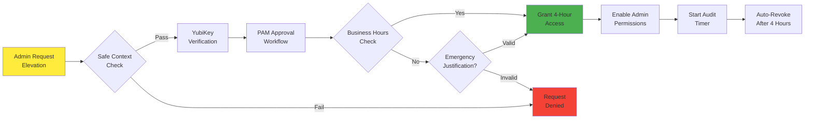
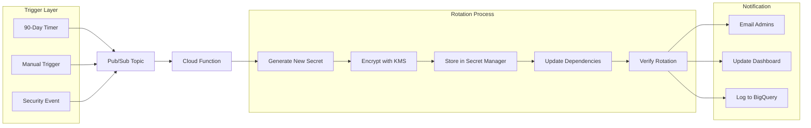

# Enterprise Authentication System: Complete Implementation Guide

## Executive Summary

This document presents a comprehensive authentication architecture designed for healthcare organizations requiring HIPAA-compliant security with advanced authentication capabilities. The system implements defense-in-depth security through multiple innovative layers that exceed industry standards while maintaining operational efficiency.

The architecture addresses critical security requirements through hardware-based authentication using YubiKey devices for human users, time-based one-time password (TOTP) authentication for service accounts and AI agents, just-in-time privileged access management following Google and Microsoft best practices, automated 90-day secret rotation cycles with zero-downtime transitions, and comprehensive audit logging for regulatory compliance.

---

## System Architecture Overview

The authentication system employs a multi-layered security approach that differentiates between human users and automated service accounts. The architecture leverages Google Cloud Platform's native security services while maintaining compatibility with Microsoft Azure for hybrid deployments.

---

## Authentication Methods

### YubiKey Implementation for Human Users

All human users must authenticate using YubiKey hardware tokens, providing phishing-resistant security that meets the highest industry standards. The implementation supports both OTP and WebAuthn/FIDO2 protocols, ensuring compatibility with modern authentication standards while maintaining backward compatibility for legacy systems.

The YubiKey enrollment process creates a cryptographic binding between the hardware token and the user's identity. During enrollment, the system generates a unique certificate chain that links the YubiKey to the user account, with the root certificate stored securely in Google Cloud Key Management Service. This approach ensures that lost or stolen YubiKeys cannot be cloned or replicated.

### Rescue Code System

The rescue code system provides emergency access when YubiKey authentication is unavailable. Each user receives eight single-use rescue codes during initial enrollment. These codes undergo cryptographic generation using secure random number generation, ensuring unpredictability and resistance to brute-force attacks.

Rescue codes are delivered through multiple secure channels to prevent single points of failure. The primary delivery method sends encrypted codes via secure email, while a secondary method splits codes across SMS messages to the user's registered mobile device. For maximum security, organizations may opt for tamper-evident printed cards stored in secure physical locations.

### TOTP Implementation for Service Accounts

Service accounts and AI agents authenticate using time-based one-time passwords following RFC 6238 standards. The TOTP implementation provides reliable authentication for automated systems while supporting programmatic secret rotation without service interruption.

The system generates TOTP secrets using cryptographically secure random number generators, creating 32-character base32-encoded secrets that provide 160 bits of entropy. These secrets undergo automatic rotation every 90 days, with a carefully orchestrated transition period that allows both old and new secrets to remain valid during the changeover window.

---

## Just-In-Time Privileged Access Management

The just-in-time (JIT) access system ensures that administrative privileges remain dormant until explicitly needed for legitimate business purposes. This approach significantly reduces the attack surface by eliminating standing privileged access that could be compromised.

### Implementation for Super Administrators

Three designated super administrators—Ralf Lukner MD PhD, Tanisha Joslyn, and Beth Lukner—hold dormant administrative privileges that activate only when specific conditions are met. The activation process requires multiple factors to ensure legitimate use while maintaining accessibility during emergencies.

The safe context validation examines multiple environmental factors before permitting elevation. The system verifies that the request originates from a trusted device with up-to-date security patches, confirms the geographic location matches expected patterns for the administrator, and ensures no concurrent security incidents are affecting the infrastructure. Additionally, the validation process checks for anomalous behavior patterns that might indicate account compromise.

### AI Agent Role Delegation

The system enables authorized humans to temporarily delegate specific roles to AI service accounts for defined tasks. This innovative approach allows AI agents to perform necessary operations while maintaining clear accountability and audit trails.

Each AI agent operates under a dedicated service account with minimal baseline permissions. When a human authorizes temporary elevation, the system creates a time-bound IAM binding that grants the specific permissions required for the task. The delegation token links all actions performed by the AI agent back to the authorizing human, ensuring complete accountability.

---

## Automated Secret Rotation System

The secret rotation system implements industry best practices for credential lifecycle management, ensuring that compromised credentials have limited windows of exploitation. The architecture supports both scheduled and emergency rotations while maintaining service availability throughout the rotation process.

### Google Cloud Implementation

The rotation system leverages Google Secret Manager's native rotation scheduling capabilities. Secret Manager publishes rotation events to designated Pub/Sub topics when rotation periods expire. Cloud Functions subscribe to these topics and execute the rotation logic, ensuring consistent and reliable secret updates.

The implementation uses sophisticated state management to handle rotation failures gracefully. Each secret maintains metadata tracking its rotation state, including timestamps for last successful rotation, current rotation attempt status, and failure counters for monitoring. This approach enables the system to resume interrupted rotations and alert administrators to persistent failures.

### Rotation Workflow

The rotation process follows a carefully orchestrated sequence that prevents service disruptions. When initiated, the system first generates new credentials using appropriate cryptographic standards. These credentials undergo encryption using Google Cloud Key Management Service before storage in Secret Manager.

The critical transition period allows both old and new credentials to remain valid simultaneously. This overlap, typically lasting 24 hours, provides sufficient time for all dependent systems to retrieve and begin using the new credentials. The system monitors credential usage during this period, ensuring successful adoption before retiring the old credentials.

---

## Emergency Break Glass Procedures

The break glass system provides critical emergency access while maintaining security and accountability. Two separate emergency accounts remain completely dormant under normal operations, activating only during genuine emergencies when standard authentication systems fail.

### Credential Security Architecture

Break glass credentials undergo sophisticated protection through credential splitting and encryption. Each emergency account's credentials are divided into two parts, with each part encrypted separately using envelope encryption. Only Ralf Lukner MD PhD and Tanisha Joslyn possess the authorization to retrieve these credential parts.

The physical separation of credential parts ensures that emergency access requires deliberate action from authorized personnel. Part A might reside in Google Secret Manager with specific access controls, while Part B could be stored in a secure physical location or separate digital vault. This separation prevents accidental or unauthorized activation while ensuring availability during emergencies.

### Activation and Monitoring

Emergency account activation triggers immediate notifications to all security administrators and executive leadership. The activation process creates comprehensive audit trails documenting the justification for emergency access, the identity of the activating administrator, and all actions performed during the emergency session.

The system enforces a maximum four-hour activation window for break glass accounts. This time limit balances the need for emergency access with security requirements. Automatic deactivation occurs when the time limit expires, ensuring that emergency privileges cannot persist beyond their intended use.

---

## Management Interfaces

### Administrative Dashboard

The custom administrative dashboard consolidates all authentication management functions into a unified interface. Built on Google Cloud Run for scalability and reliability, the dashboard provides role-based access to different administrative functions.

The dashboard's user management section enables administrators to enroll new users, register YubiKey devices, and manage rescue codes. The interface guides administrators through each process with built-in validation to prevent configuration errors. Real-time status indicators show the current state of each user account, including recent authentication attempts and active sessions.

For secret rotation management, the dashboard provides visibility into rotation schedules, current rotation status, and historical rotation events. Administrators can trigger manual rotations when necessary and monitor the progress of automated rotations. The interface includes predictive analytics that identify secrets approaching rotation deadlines.

### Compliance Reporting

The system generates comprehensive compliance reports tailored for HIPAA audits and regulatory reviews. These reports aggregate data from multiple sources, including authentication logs from Cloud Functions, privilege elevation events from the JIT system, secret rotation history from Secret Manager, and break glass activation records.

Reports can be generated on-demand or scheduled for automatic delivery to compliance officers. The system supports multiple output formats, including PDF for formal documentation and CSV for detailed analysis. All reports undergo integrity protection through digital signatures, ensuring their authenticity for regulatory purposes.

---

## HIPAA Compliance and Healthcare Integration

### Platform Compliance Configuration

With existing Business Associate Agreements for both Google Cloud Platform and Microsoft Azure, the authentication system can leverage either platform's HIPAA-compliant services. The architecture implements all required technical safeguards mandated by HIPAA security rules.

Encryption protects all data at rest and in transit using FIPS 140-2 validated cryptographic modules. Google Cloud Key Management Service provides hardware security module (HSM) protection for encryption keys, ensuring that cryptographic materials remain protected against extraction. Network communications utilize TLS 1.3 with perfect forward secrecy, preventing retroactive decryption of captured traffic.

Access controls implement the principle of least privilege throughout the system. Each component operates with minimal permissions required for its function. The Redis ACL system enforces granular permissions based on user roles, ensuring that authenticated users can access only the resources necessary for their responsibilities.

### Audit Logging and Monitoring

The authentication system maintains comprehensive audit logs that exceed HIPAA requirements for security incident tracking. Every authentication attempt, successful or failed, generates detailed log entries capturing relevant metadata. These logs flow into BigQuery for long-term retention and analysis.

The logging architecture captures critical security events including user authentication attempts with outcomes and metadata, privilege elevation requests and approvals, secret rotation events and any failures, break glass activations with full activity logs, and configuration changes to the authentication system itself. Log entries include correlation identifiers that enable tracking related events across multiple system components.

Real-time monitoring leverages Google Cloud's operations suite to detect and alert on security anomalies. The system establishes baseline behavior patterns for each user and service account. Deviations from these patterns trigger alerts for investigation. Machine learning models identify potentially compromised accounts based on unusual authentication patterns or geographic anomalies.

---

## Implementation Roadmap

### Phase 1: Core Infrastructure Deployment

The initial implementation phase establishes the foundational Google Cloud Platform services. This includes configuring Secret Manager with appropriate encryption and access controls, deploying Cloud Functions for authentication logic, establishing Pub/Sub topics and subscriptions for event distribution, and implementing the Redis ACL system for session management.

### Phase 2: Authentication Method Implementation

The second phase implements the various authentication methods. YubiKey support requires developing enrollment workflows and validation logic. The TOTP system needs secret generation and validation capabilities. Rescue code generation and secure distribution mechanisms must be established. Each authentication method undergoes thorough testing before proceeding to the next phase.

### Phase 3: Advanced Features

The final phase adds sophisticated capabilities including just-in-time privileged access management, automated secret rotation, break glass emergency procedures, and the administrative dashboard. These features build upon the stable foundation established in earlier phases.

### Ongoing Operations

Following initial deployment, the system requires continuous monitoring and maintenance. Regular security assessments ensure the authentication system remains resilient against evolving threats. Compliance audits verify ongoing adherence to HIPAA requirements. Performance optimization maintains responsive authentication even as user populations grow.

---

## Security Best Practices

### Defense in Depth

The authentication system implements multiple overlapping security controls. If one control fails, others continue protecting the infrastructure. This layered approach significantly increases the difficulty for attackers attempting to compromise the system.

Hardware-based authentication through YubiKey provides the strongest protection against phishing and credential theft. Time-based controls through JIT access minimize exposure windows for privileged operations. Cryptographic protections through proper key management ensure data confidentiality. Comprehensive logging enables rapid detection and response to security incidents.

### Zero Trust Principles

The architecture assumes no implicit trust, even for authenticated users. Every request undergoes validation against current permissions and context. Session tokens include embedded permissions that the system validates on each use. This approach prevents privilege escalation and limits the impact of compromised sessions.

Network segmentation further implements zero trust principles. Authentication services operate in isolated network segments with strictly controlled ingress and egress. Service-to-service communications require mutual TLS authentication. API endpoints implement rate limiting to prevent abuse.

### Incident Response Preparedness

The system design facilitates rapid incident response when security events occur. The break glass procedures ensure that administrators can always regain control during emergencies. Comprehensive logging provides the forensic data necessary for incident investigation. Automated responses can immediately disable compromised accounts or trigger additional authentication requirements during suspected attacks.

---

## Conclusion

This enterprise authentication system provides healthcare organizations with security controls that exceed industry standards while maintaining operational efficiency. The architecture's flexibility allows adaptation to specific organizational requirements while preserving core security principles. Through careful implementation of the documented components, organizations can achieve HIPAA compliance while protecting against sophisticated threats to their authentication infrastructure.