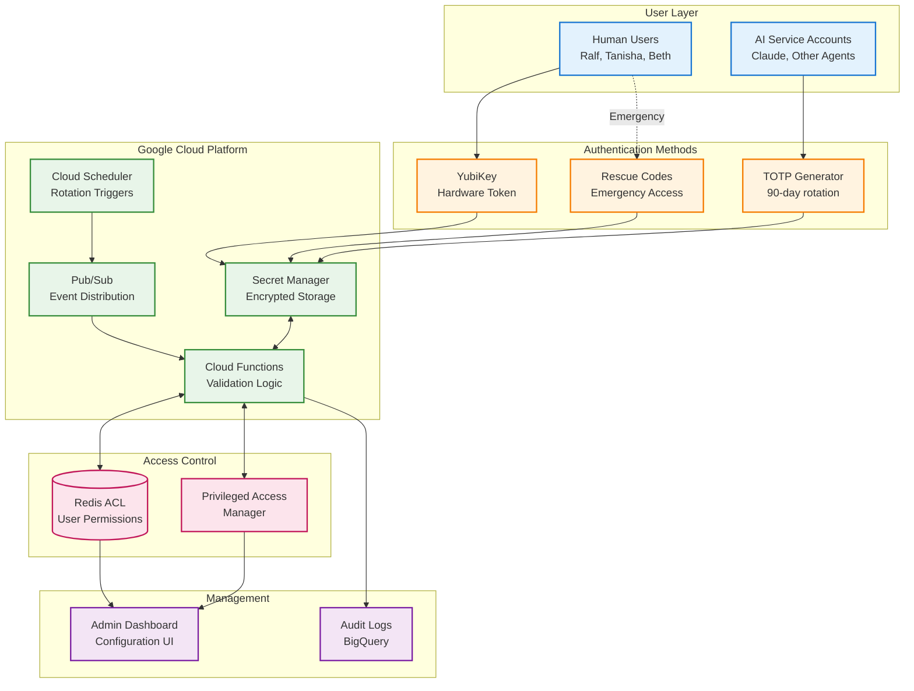
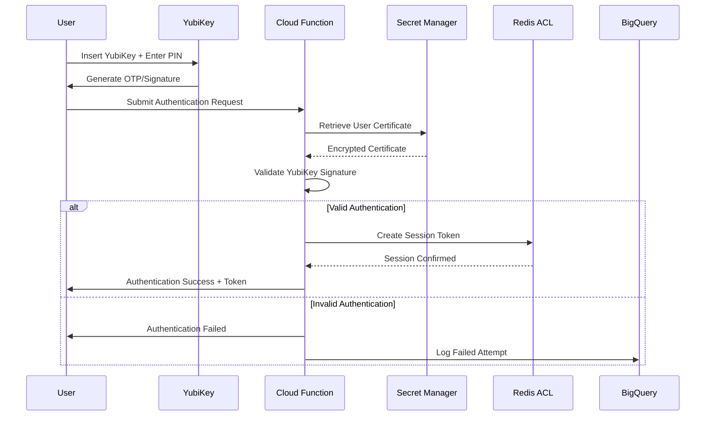
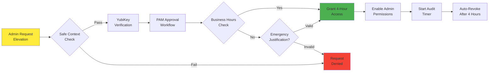
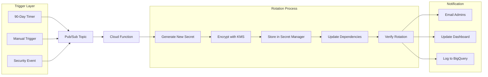

# Authentication System Diagrams

## System Architecture Overview



## YubiKey Authentication Flow



## Just-In-Time Admin Access Flow



## Secret Rotation Architecture



## Infrastructure Deployment Using Python Diagrams

```python
# Save this as generate_infrastructure_diagram.py
from diagrams import Diagram, Cluster, Edge
from diagrams.gcp.compute import Functions
from diagrams.gcp.database import Memorystore
from diagrams.gcp.security import KMS, SecurityCommandCenter
from diagrams.gcp.storage import Storage
from diagrams.gcp.analytics import BigQuery, PubSub
from diagrams.gcp.devtools 